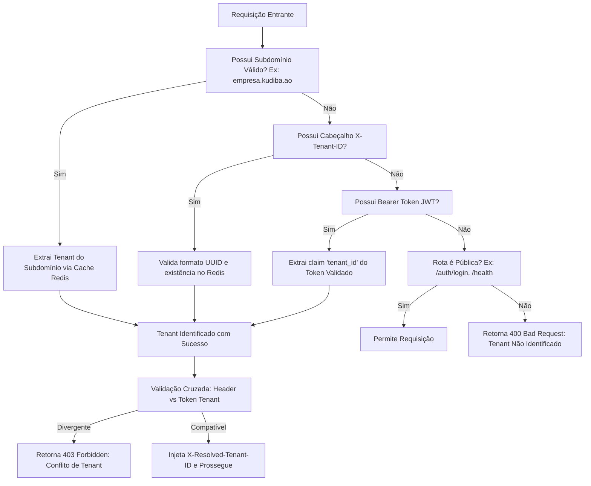
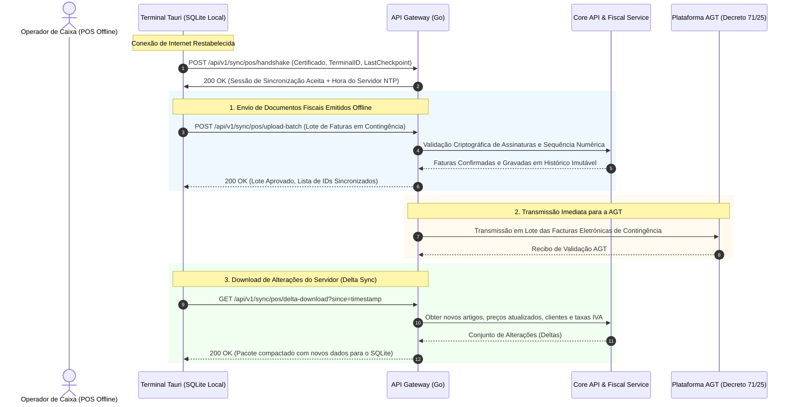

# Arquitetura e Engenharia do API Gateway (Entrypoint API) - ERP Kudiba

**Documento:** Especificação Técnica de Engenharia do API Gateway  
**Versão:** 1.0.0  
**Data:** Outubro de 2026  
**Sistema:** ERP Kudiba (Cloud-Native & Edge-Ready para Angola)  
**Conformidade:** Decreto Presidencial n.º 71/25 de 20 de Março (Facturação Electrónica e Regime Jurídico de Facturas) e Validação de Software AGT  

---

## 1. Visão Executiva e Papel do Entrypoint

No ecossistema do ERP Kudiba, o **API Gateway** constitui a porta única de entrada (*Single Entrypoint*) para todo o tráfego HTTP/HTTPS, WebSocket e gRPC originado no exterior do cluster de backend. Todos os clientes — sejam a aplicação Web de Gestão (Next.js SPA), os terminais de Ponto de Venda de secretária (Tauri POS Offline-First), dispositivos móveis de armazém, integrações com banca/fintechs locais (Multicaixa GPO / EMIS) ou webservices regulatórios da Administração Geral Tributária (AGT) — conectam-se exclusivamente através deste componente perimétrico.

```
+---------------------------------------------------------------------------------------------------+
|                                          CLIENTES EXTERNOS                                        |
|  [ Next.js Backoffice ]   [ Tauri POS Desktop (Edge) ]   [ Fintechs / GPO ]   [ Plataforma AGT ]  |
+---------------------------------------------------------------------------------------------------+
                                                  |
                                                  | HTTPS (TLS 1.3) / WSS / gRPC
                                                  v
+---------------------------------------------------------------------------------------------------+
|                                  API GATEWAY (ENTRYPOINT ENGINE)                                  |
|                                                                                                   |
|  +---------------------+   +---------------------+   +---------------------+   +---------------+  |
|  |  WAF & Rate Limiter |   |  Tenant Resolution  |   |  JWT / HMAC Auth    |   | Idempotency   |  |
|  |  (Sliding Window)   |   |  (Subdomain/Header) |   |  (Ed25519 / JWKS)   |   | (RFC 8935)    |  |
|  +---------------------+   +---------------------+   +---------------------+   +---------------+  |
|  +---------------------+   +---------------------+   +---------------------+   +---------------+  |
|  |  AGT Contingency    |   |  Reverse Proxy &    |   |  OpenTelemetry      |   | Circuit       |  |
|  |  Monitor (60 dias)  |   |  Intelligent Router |   |  Distributed Trace  |   | Breaker       |  |
|  +---------------------+   +---------------------+   +---------------------+   +---------------+  |
+---------------------------------------------------------------------------------------------------+
                                                  |
                       +--------------------------+--------------------------+
                       | Rede Privada Interna (Zero-Trust VPC / Docker Network) |
                       v                                                     v
        +------------------------------+                      +------------------------------+
        |     CORE API SERVER (Go)     |                      |    FISCAL ENGINE SERVICE     |
        | - Autenticação & Perfis      |                      | - Assinatura Digital RSA     |
        | - Faturação Comercial        |                      | - Cadeia Hash SHA-256 AGT    |
        | - Gestão de Armazéns/Stock   |                      | - Geração e Validação SAF-T  |
        +------------------------------+                      +------------------------------+
                       |                                                     |
                       +--------------------------+--------------------------+
                                                  |
                                                  v
                               +-------------------------------------+
                               |       INFRAESTRUTURA DE DADOS       |
                               |  PostgreSQL 16+  |  Redis 7+ (Bus)  |
                               +-------------------------------------+
```

### 1.1 Objetivos de Engenharia
1. **Latência de Trânsito Mínima:** Overhead perimétrico inferior a **5ms (p99)** através de proxy reverso compilado em Go, eliminando gargalos em operações de caixa de alta rotação.
2. **Resiliência e Tolerância a Falhas de Rede em Angola:** Suporte nativo a conexões móveis e de satélite instáveis (Unitel, Africell, Movicel), prevendo reconexões automáticas, compressão agressiva (Brotli/zstd), HTTP/3 (QUIC) e sincronização offline-first idempotente.
3. **Isolamento de Segurança Perimétrica (Zero-Trust):** Sanitização rigorosa de cabeçalhos de entrada para evitar *Header Spoofing*, validação criptográfica de tokens e isolamento lógico absoluto por organização (*Multi-Tenancy*).
4. **Governança Regulatória Estrita (AGT):** Aplicação das regras do **Decreto Presidencial n.º 71/25**, com ênfase no monitoramento de contingência (bloqueio mandatado por lei caso a falha de comunicação com a AGT exceda 60 dias) e proteção de integridade dos dados fiscais.

---

## 2. Seleção Tecnológica e Racional Arquitetural (ADRs)

A escolha dos componentes tecnológicos obedece ao princípio de alto desempenho nativo, estabilidade de longo prazo, reduzido consumo de recursos e ausência de dependências proprietárias caras.

### 2.1 Análise Comparativa de Linguagens e Runtimes para o API Gateway

O API Gateway é o gargalo potencial de todo o tráfego do ERP. Cada requisição externa — seja uma leitura de catálogo, um handshake de PDV ou uma emissão fiscal de alta criticidade — precisa transitar por ele, sofrer verificações criptográficas, resolução de tenant e controle de rate limiting antes de alcançar o destino.

Para fundamentar a decisão técnica de engenharia, foi elaborado um estudo comparativo rigoroso entre as cinco principais tecnologias candidatas: **NestJS (Node.js)**, **Flask (Python)**, **.NET (C#)**, **Rust** e **Go (Golang)**.

#### 2.1.1 Matriz Comparativa Multicritério

| Vetor de Análise | NestJS (Node.js 20+) | Flask (Python 3.12+) | .NET 8/9 LTS (C# / YARP) | Rust (Axum / Tokio) | Go 1.23+ (net/http / Chi) |
| :--- | :--- | :--- | :--- | :--- | :--- |
| **Throughput Bruto (Req/s)** | Médio-Alto (~35k req/s com Fastify) | Baixo (~6k - 10k req/s com Gunicorn) | Muito Alto (~90k - 120k req/s) | Máximo Absoluto (~150k+ req/s) | Muito Alto (~100k - 130k req/s) |
| **Latência de Trânsito (p99)** | ~12ms - 25ms (sujeito ao Event Loop) | ~40ms - 90ms (alto jitter sob carga) | **< 3ms** (Kestrel / YARP) | **< 0.8ms** (Zero GC) | **< 2ms** (GC concorrente sub-ms) |
| **Consumo de Memória (RSS / Réplica)** | 150 MB - 300 MB (V8 Heap) | 90 MB - 160 MB *por processo worker* | 80 MB - 160 MB (~35MB em Native AOT) | **12 MB - 25 MB** | **25 MB - 45 MB** |
| **Modelo de Concorrência** | Single-threaded Event Loop (libuv) | Process-based (WSGI) / ASGI assíncrono | Thread Pool assíncrona (`async/await`) | Tasks assíncronas cooperativas (Tokio) | **Goroutines leves (2KB stack inicial)** |
| **Sensibilidade a Bloqueios de CPU** | **Alta**: JSON parsing pesado ou crypto bloqueia o loop | **Muito Alta**: GIL e overhead interpretado | Baixa: Processamento paralelo em multi-core | Nula: Paralelismo nativo sem runtime lock | **Nula**: Scheduler M:N preemptivo |
| **Tooling Dedicado para Reverse Proxy** | Médio (`http-proxy-middleware`, Fastify-reply-from) | Muito Pobre (não desenhado para proxy) | **Excelente (YARP - Yet Another Reverse Proxy)** | Bom (`hyper`, `tower`, `pingora`) | **Excepcional (`net/http/httputil`, Traefik core)** |
| **Curva de Aprendizagem & Time-to-Market** | Rápida (comum no mercado TS) | Rápida para scripts, lenta para alta escala | Moderada (requer domínio do ecossistema .NET) | **Muito Longa** (Borrow Checker, Lifetimes) | **Muito Rápida** (Sintaxe enxuta, pragmática) |
| **Disponibilidade de Engenheiros (Mercado)** | Elevada | Elevada (focada em data/scripting) | Média-Elevada (muito comum em banca/ERP) | **Raríssima e com custo elevado** | Média-Crescente (rápido onboarding) |
| **TCO / Custo de Infraestrutura (VPS)** | Médio (maior consumo de RAM/CPU) | Elevado (necessita de dezenas de workers) | Baixo (alta eficiência de recursos) | Mínimo | **Mínimo** |

---

#### 2.1.2 Avaliação Detalhada por Tecnologia

##### 1. Flask (Python) — *Desqualificado para Gateway Perimétrico*
* **Pontos Fortes:** Sintaxe extremamente expressiva, ecossistema riquíssimo para ciência de dados, machine learning e automações.
* **Por que não utilizar no API Gateway:**
  * O Python possui o GIL (*Global Interpreter Lock*) que limita o paralelismo real de threads. Mesmo com ASGI (Quart/Uvicorn), o overhead interpretado por requisição gera latências proibitivas sob concorrência.
  * Para suportar 10.000 conexões persistentes simultâneas de PDVs e WebSockets, o Flask exige arquiteturas baseadas em múltiplos processos (`gunicorn -w 16`), elevando o consumo de RAM para múltiplos gigabytes com alta contenção de CPU.
* **Veredito:** Inviável como porta de entrada de alta performance de um ERP moderno.

##### 2. NestJS (TypeScript / Node.js) — *Viável para BFF, Subótimo para Gateway Perimétrico*
* **Pontos Fortes:** Curva de aprendizado suave para desenvolvedores que já dominam TypeScript no frontend (Next.js), arquitetura opinativa com módulos, injeção de dependências e excelente DX.
* **Limitações Críticas no Perímetro:**
  * O modelo de execução do Node.js baseia-se em um *Event Loop* de thread única. Se um middleware perimétrico realizar operações criptográficas síncronas (como validação de assinaturas de webhook HMAC, validação intensiva de schemas JSON grandes ou verificação de chaves RSA), o event loop congela momentaneamente, degradando a latência de todas as outras requisições concorrentes.
  * O consumo de memória do motor V8 varia entre 150MB e 300MB por pod, o que encarece o escalonamento horizontal em ambientes de nuvem.
* **Veredito:** Aceitável para camadas de agregação de frontend (BFF - *Backend for Frontend*), porém ineficiente e arriscado como Gateway Perimétrico de missão crítica.

##### 3. .NET 8/9 LTS (C# / ASP.NET Core) — *Forte Competidor (Vice-Líder)*
* **Pontos Fortes:**
  * Possui o **YARP (Yet Another Reverse Proxy)**, biblioteca desenvolvida e mantida pela própria Microsoft especificamente para construção de API Gateways customizados e robustos.
  * O servidor web Kestrel figura consistentemente entre os mais velozes do mundo em benchmarks industriais (TechEmpower).
  * Tipagem estática rigorosa, excelente suporte para gRPC nativo, HTTP/3, WebSockets e criptografia de hardware.
  * Suporte a *Native AOT* (.NET 8/9), compilando diretamente para código de máquina sem dependência de JIT pesado, reduzindo o consumo de memória para ~35MB.
* **Desvantagens em Relação a Go:**
  * Curva de configuração e complexidade de abstrações superior (IoC container pesado, reflection se não configurado com AOT).
  * Ecossistema cloud-native global (Kubernetes, Docker, Envoy) tem como língua franca nativa o Go.
* **Veredito:** **Excelente opção corporativa**. Caso a equipa técnica decida padronizar o backend corporativo em C#, o ASP.NET Core com YARP é uma escolha extremamente sólida e validada em produção.

##### 4. Rust (Axum / Tokio / Hyper) — *O Ápice da Performance Pura, com Alto Risco de Entrega*
* **Pontos Fortes:**
  * Desempenho incomparável e consumo de memória quase desprezível (~15MB RSS).
  * Sem Garbage Collector: latências previsíveis e sem pausas (latência p99 < 1ms).
  * Segurança de memória garantida em tempo de compilação (*Zero data races*, ausência de *null pointer exceptions*). Projetos como o Cloudflare Pingora demonstram a hegemonia técnica de Rust em proxies reversos.
* **Limitações Práticas para o Projeto Kudiba:**
  * Curva de aprendizagem acentuada (*borrow checker*, gerenciamento estrito de lifetimes em async traits e tower layers).
  * Escassez crítica de engenheiros especializados em Rust no mercado angolano e regional, tornando o custo de contratação exorbitante e desacelerando a velocidade de implementação do MVP.
* **Veredito:** Superlativo tecnicamente, mas com risco operacional e de cronograma desnecessário para o estágio atual do ERP.

##### 5. Go (Golang 1.23+) — *A Escolha Ótima (Ponto de Equilíbrio / Sweet Spot)*
* **Por que Go é a escolha ideal para o API Gateway do Kudiba:**
  1. **Concorrência Nativa com Goroutines:** Cada conexão de entrada é tratada por uma goroutine independente, que consome apenas ~2KB de memória inicial e é gerenciada pelo runtime M:N preemptivo do Go. Uma única instância suporta com facilidade mais de 50.000 conexões persistentes com menos de 60MB de RAM.
  2. **Standard Library de Classe Mundial:** O pacote `net/http/httputil` do Go já traz nativamente um `ReverseProxy` testado e validado nos maiores provedores de infraestrutura do mundo (a base de projetos como Traefik, Caddy e Kubernetes Ingress).
  3. **Garbage Collector Concorrente Otimizado para Baixa Latência:** O GC do Go realiza pausas inferiores a 1 milissegundo, garantindo SLA estável mesmo sob rajadas de tráfego de faturamento.
  4. **Binário Único Estático e Segurança:** Compilado nativamente sem dependências de bibliotecas dinâmicas do sistema operacional, permitindo empacotamento em containers `scratch` ou `distroless` de apenas 15MB, com superfície de ataque praticamente nula.
  5. **Pragmatismo e Facilidade de Contratação:** Go possui uma sintaxe deliberadamente concisa (apenas 25 palavras-chave). Qualquer desenvolvedor sênior de TypeScript, C# ou Java torna-se produtivo em Go em menos de duas semanas.

#### 2.1.3 Decisão Arquitetural Oficial (ADR-001: Linguagem do API Gateway)
* **Status:** **APROVADO & ADOTADO (Outubro de 2026)**
* **Linguagem Oficial:** **Rust (Edição 2021+)**
* **Framework / Engine:** **Axum 0.7 + Tokio Runtime + Tower Http + Reqwest/Hyper**
* **Justificativa Estratégica da Decisão:**
  1. **Máximo Desempenho e Latência p99 Sub-Milissegundo (< 0.8ms):** Ausência total de Garbage Collector, garantindo que mesmo sob rajadas extremas de requisições de caixa e webhooks, não existam pausas de GC.
  2. **Consumo Mínimo de Recursos (RSS ~15MB):** O container de execução roda com footprint de memória minúsculo, viabilizando nós de baixo custo e alta densidade de réplicas.
  3. **Segurança de Memória Garantida pelo Compilador (*Zero-Cost Abstractions*):** Imunidade a falhas de concorrência (*data races*) e ponteiros nulos em tempo de compilação.
  4. **Sinergia Arquitetural Perfeita com o Tauri POS (Edge Offline-First):** Como a aplicação de PDV de secretária do ERP Kudiba é desenvolvida em **Tauri (Rust + Web)**, a adoção de Rust no API Gateway permite o **reaproveitamento direto de crates internas, structs de domínio, algoritmos criptográficos da AGT (assinatura RSA e cálculo de hash em cadeia) e protocolos binários de sincronização** entre o caixa local e o Gateway na nuvem!

### 2.2 Camada de Estado Efêmero e Cache Perimétrico: **Redis 7.4+**
* **Funções no Gateway:**
  1. **Rate Limiting Distribuído:** Algoritmo *Sliding Window Counter* executado de forma atómica via scripts Lua em Redis.
  2. **Validação de Idempotência:** Armazenamento temporário de respostas de transações com lock atómico (`SET NX PX`) para o cabeçalho `Idempotency-Key` (TTL padrão de 24 horas).
  3. **Revogação Instantânea de Sessões (Blacklist JWT):** Validação imediata de logout ou bloqueio de operadores sem necessidade de consultas à base de dados relacional.
  4. **Controlo do Contador de Contingência AGT:** Registo do timestamp do último contato bem-sucedido com a AGT por organização.

### 2.3 Camada de Segurança Perimétrica & TLS
* **Terminação TLS 1.3:** Suporte obrigatório a cifras criptográficas modernas (`TLS_AES_256_GCM_SHA384`, `TLS_CHACHA20_POLY1305_SHA256`).
* **mTLS (Mutual TLS):** Opcional e configurável para canais dedicados de terminais POS físicos e conexões diretas B2B com entidades bancárias (Multicaixa GPO).

### 2.4 Observabilidade e Rastreabilidade Distribuída
* **OpenTelemetry (OTel) Go SDK:**
  * Injeção e propagação estrita do padrão W3C `traceparent` e `tracestate`. Cada requisição que entra no Gateway recebe ou valida um `X-Correlation-ID` e `trace_id`.
* **Prometheus:** Exportador de métricas nativo na rota interna `GET /metrics` baseado no modelo RED (*Rate, Errors, Duration*).
* **Structured Logging:** Biblioteca `uber-go/zap` com serialização estruturada em JSON, registrando `method`, `path`, `status`, `duration_ms`, `tenant_id`, `client_ip`, `user_agent` e `trace_id`.

---

## 3. Topologia de Rede e Zonas de Segurança

Para garantir isolamento rigoroso de acordo com os padrões corporativos, o tráfego é segmentado em zonas com permissões decrescentes:

```
[ INTERNET PÚBLICA ]
         |
         | Porta 443 / HTTPS (TLS 1.3)
         v
+--------------------------------------------------------------------+
| ZONA DMZ (Edge / Gateway Ingress)                                  |
|                                                                    |
|  +--------------------------------------------------------------+  |
|  | API Gateway Instance (Go)                                    |  |
|  |                                                              |  |
|  | - Bloqueio de IP por Reputação / Geofencing (Opcional)       |  |
|  | - Validação de Certificado SSL / SNI                         |  |
|  | - Validação Sintática de Cabeçalhos e Tamanho de Body         |  |
|  | - Descarte de cabeçalhos internos não autorizados             |  |
|  +--------------------------------------------------------------+  |
+--------------------------------------------------------------------+
         |
         | Rede Interna Isolada (VPC / Docker Overlay Segura)
         v
+--------------------------------------------------------------------+
| ZONA PRIVADA (Core Application & Data Tier)                        |
|                                                                    |
|  +-------------------------+      +-----------------------------+  |
|  | Core API Server         |      | Fiscal Engine Service       |  |
|  | (10.0.10.10:8080)       |      | (10.0.10.20:9090 - gRPC)    |  |
|  +-------------------------+      +-----------------------------+  |
|               |                                  |                 |
|               +----------------+-----------------+                 |
|                                |                                   |
|                                v                                   |
|               +----------------------------------+                 |
|               | PostgreSQL 16 Primário & Réplicas|                 |
|               | Redis 7 Cluster Interno          |                 |
|               +----------------------------------+                 |
+--------------------------------------------------------------------+
```

### 3.1 Tratamento e Prevenção de Header Spoofing
O Gateway é a autoridade de fronteira. Para proteger os serviços internos contra injeção fraudulenta de contexto por clientes maliciosos:
1. **Headers Removidos Imediatamente na Entrada:**
   * Qualquer cabeçalho que comece com `X-Resolved-*` (ex: `X-Resolved-Tenant-ID`, `X-Resolved-User-ID`, `X-Resolved-Roles`).
   * Headers de infraestrutura forjados como `X-Forwarded-Host` e `X-Real-IP` (o IP real é extraído de `RemoteAddr` ou de proxies upstream confiáveis devidamente configurados por CIDR).
2. **Headers Confiáveis Injetados para o Backend Interno:**
   * `X-Resolved-Tenant-ID`: UUID verificado da organização.
   * `X-Resolved-User-ID`: UUID do utilizador autenticado.
   * `X-Resolved-User-Email`: Email do utilizador.
   * `X-Resolved-Roles`: Perfis de acesso normalizados (ex: `ADMIN`, `CASHIER`, `ACCOUNTANT`).
   * `X-Correlation-ID`: Identificador único de rastreio da requisição.

---

## 4. Multi-Tenancy e Resolução de Contexto Organizacional

O ERP Kudiba é uma plataforma Multi-Tenant SaaS desenhada para hospedar desde microempresas com um único terminal POS até grandes retalhistas com dezenas de filiais espalhadas por Angola.

O API Gateway implementa uma estratégia de resolução em três níveis hierárquicos:



### 4.1 Validação Cruzada (Cross-Validation) de Tenant
Se a requisição contiver tanto o cabeçalho `X-Tenant-ID` quanto um token de autenticação JWT:
* O Gateway compara estritamente o valor do cabeçalho com a claim `tenant_id` assinada no JWT.
* Caso haja qualquer divergência, a requisição é **imediatamente rejeitada com código HTTP `403 Forbidden`**, prevenindo tentativas de exploração horizontal de dados entre empresas.

---

## 5. Autenticação, Autorização e Gestão de Chaves

O Gateway valida credenciais e tokens no perímetro, assegurando que requisições ilegítimas nunca alcancem o Core da aplicação.

### 5.1 Validação de Tokens JWT (Sem Ida ao Banco)
1. **Algoritmo Criptográfico:** Utilização de assinaturas assimétricas **Ed25519** (EdDSA) ou **RS256** (RSA com SHA-256).
2. **JWKS Perimétrico em Cache:**
   * O Core de Autenticação publica suas chaves públicas em um endpoint interno `/auth/.well-known/jwks.json`.
   * O API Gateway carrega e mantém o JWKS em memória com atualização em background a cada 15 minutos (ou acionamento imediato via canal Pub/Sub no Redis quando ocorre rotação de chaves).
   * **Vantagem:** O Gateway valida assinaturas de tokens a velocidade de microssegundos em CPU, com **zero chamadas de rede ou consultas a base de dados**.

### 5.2 Estrutura das Claims do JWT
```json
{
  "iss": "https://auth.kudiba.ao",
  "sub": "b2f679e0-8fa3-4217-a02b-a0d33e9d8e01",
  "tenant_id": "4e7d4a22-26cb-4029-a78b-3d607f2df412",
  "branch_id": "8f9024f7-33e1-45f8-8bb3-d021c1729b80",
  "terminal_id": "pos-luanda-loja-01",
  "email": "operador@empresa.ao",
  "roles": ["CASHIER", "INVOICE_ISSUER"],
  "permissions": [
    "invoices:create",
    "invoices:read",
    "cash_register:operate"
  ],
  "exp": 1790899200,
  "iat": 1790895600,
  "jti": "d0943ff7-b12a-4db3-96b0-7e0e7a17f76b"
}
```

### 5.3 Autenticação de Máquina para Máquina (M2M) e Webhooks
Para serviços externos (bancos, gateways de pagamento Multicaixa Express e provedores ERP):
* **API Key + Assinatura HMAC-SHA256:**
  * O parceiro envia o cabeçalho `X-Api-Key` juntamente com `X-Signature-SHA256` contendo o hash HMAC do payload calculado com o segredo partilhado.
  * O Gateway valida a assinatura antes de autorizar o roteamento do webhook.

---

## 6. Conformidade Regulatória AGT & Decreto Presidencial n.º 71/25 no Gateway

O **Decreto Presidencial n.º 71/25 de 20 de Março de 2025** estabelece o regime jurídico de emissão, conservação e arquivamento de facturas e institui a obrigatoriedade da **Facturação Electrónica** com transmissão em tempo real das informações para a AGT.

O API Gateway incorpora controles nativos no perímetro para assegurar o cumprimento integral deste diploma legal:

### 6.1 Monitor de Contingência e Bloqueio Mandatário dos 60 Dias
* **Exigência Legal (DP n.º 71/25, Artigo relativo à Contingência):**
  > *"Em caso de inoperacionalidade que impossibilite a facturação electrónica, é permitida a emissão em contingência/offline. Todavia, em caso de falha na comunicação superior a 60 dias com a Plataforma Electrónica da AGT, o sistema informático deve obrigatoriamente bloquear a emissão de novos documentos fiscais."*
* **Implementação Técnica no Gateway:**
  1. O Gateway mantém no Redis uma chave de controle: `fiscal:contingency:{tenant_id}:last_successful_sync`.
  2. A cada requisição dirigida aos endpoints de emissão (`POST /api/v1/fiscal/invoices`), o middleware `FiscalContingencyMiddleware` avalia:
     $$\Delta t = \text{DataAtual} - \text{DataUltimaSincronizacaoAGT}$$
  3. Se $\Delta t > 60 \text{ dias}$, a requisição é interceptada no próprio Gateway antes de consumir recursos do Core:
     * **HTTP Status:** `423 Locked`
     * **Código do Erro:** `AGT_COMMUNICATION_TIMEOUT_EXCEEDED`
     * **Mensagem:** *"Emissão fiscal bloqueada por determinação do Decreto Presidencial n.º 71/25 da República de Angola. O sistema excedeu o limite máximo legal de 60 dias sem comunicação com a Plataforma Electrónica da AGT. Conecte o terminal à internet para restabelecer o serviço."*

### 6.2 Transmissão em Tempo Real para a Plataforma AGT
* O Gateway atua como proxy reverso e gerenciador de filas para o serviço de transmissão contínua com os webservices da AGT.
* **Modo Online:** Documentos emitidos pelo Core são enfileirados e despachados em streaming assíncrono para a AGT em menos de 2 segundos após a emissão.
* **Tratamento de Indisponibilidade da AGT:** Se a plataforma governamental estiver instável ou offline, o Gateway armazena os recibos de contingência localmente e ativa retentativas automáticas com *Exponential Backoff* e *Jitter*.

---

## 7. Políticas de Resiliência, Gestão de Tráfego e Confiabilidade

### 7.1 Rate Limiting Distribuído (Sliding Window Counter)
O Gateway protege os serviços internos contra sobrecargas, ataques de força bruta e clientes mal configurados. As cotas são controladas via Redis por chave combinada `ratelimit:{tenant_id}:{client_ip}:{route_tier}`:

| Camada / Tipo de Rota | Limite Padrão | Janela Temporal | Resposta em Caso de Excesso |
| :--- | :--- | :--- | :--- |
| **Autenticação (`/api/v1/auth/*`)** | 10 requisições | 1 minuto | `429 Too Many Requests` (com `Retry-After: 60`) |
| **Emissão Fiscal (`/api/v1/fiscal/invoices`)** | 120 requisições | 1 minuto | `429 Too Many Requests` (para proteção de séries) |
| **Sincronização POS Batch (`/api/v1/sync/pos/*`)** | 30 requisições | 1 minuto | `429 Too Many Requests` |
| **Consultas e Leitura Geral (`GET /api/v1/*`)** | 600 requisições | 1 minuto | `429 Too Many Requests` |
| **Webhooks Externos de Pagamento** | 300 requisições | 1 minuto | `429 Too Many Requests` |

### 7.2 Tratamento de Idempotência Estrita (RFC 8935)
Para operações de escrita crítica onde duplicatas causariam estragos fiscais ou financeiros (emissão de faturas, débitos, registo de pagamentos):
1. O cliente **deve** enviar o cabeçalho `Idempotency-Key: <UUIDv4>`.
2. O Gateway executa um lock atómico no Redis: `SET idempotency:{tenant_id}:{key} IN_PROGRESS NX EX 120`.
   * Se a chave já existir com status `IN_PROGRESS`, retorna `409 Conflict` informando que a operação está a ser processada.
   * Se a chave contiver a resposta anterior concluída em cache, retorna a resposta serializada com o header `Idempotent-Replay: true`.
3. Após a conclusão bem-sucedida pelo serviço interno, o resultado HTTP final é gravado com TTL de 24 horas.

### 7.3 Circuit Breaker e Degradação Graciosa
* Cada upstream (Core API, Fiscal Engine, Plataforma AGT) possui um Circuit Breaker com três estados:
  * **Fechado (Operação Normal):** Tráfego flui normalmente.
  * **Aberto (Falha Contínua):** Se a taxa de erro nos últimos 60 segundos superar 50%, o circuito abre e rejeita requisições imediatamente com `503 Service Unavailable`, poupando os serviços saturados.
  * **Semi-Aberto (Sonda de Recuperação):** Após 15 segundos, permite a passagem de 5% das requisições para verificar a recuperação do serviço upstream.

---

## 8. Arquitetura de Sincronização POS Offline-First (Edge Synchronization)

Devido às condições de infraestrutura em diversas províncias e zonas remotas de Angola, o POS de secretária do Kudiba (desenvolvido em Tauri / Rust com SQLite local) opera de forma completamente autónoma sem conexão com a internet.

O API Gateway atua como o orquestrador perimétrico do protocolo de sincronização:



---

## 9. Estrutura de Código Implementada para o API Gateway (Rust)

A implementação do Gateway dentro de `Backend/` adota a estrutura padrão e idiomática em Rust (Edição 2021) com Axum, Tokio e Tower:

```
Backend/
├── Cargo.toml                         # Manifesto Rust de dependências e profiles de release
│
├── src/
│   ├── main.rs                        # Entrypoint, Tokio runtime e graceful shutdown
│   ├── server.rs                      # Roteador Axum, montagem de middlewares e probes
│   ├── config.rs                      # Carregamento e validação de variáveis de ambiente
│   ├── errors.rs                      # Modelos de erro em conformidade RFC 7807 (Problem Details)
│   ├── proxy.rs                       # Reverse Proxy assíncrono com pooling via reqwest/hyper
│   │
│   └── middleware/
│       ├── mod.rs                     # Declaração dos submódulos de middleware
│       ├── correlation.rs             # Injeção e propagação de X-Correlation-ID
│       ├── tenant.rs                  # Sanitização anti-spoofing e resolução Multi-Tenant
│       ├── ratelimit.rs               # Sliding Window distribuído via script Redis Lua
│       ├── auth.rs                    # Validação de JWT, blacklist no Redis e cross-validation
│       ├── contingency.rs             # Bloqueio mandatário de 60 dias da AGT (DP 71/25)
│       └── idempotency.rs             # Controle de Idempotency-Key (RFC 8935) com cache 24h
│
├── deploy/
│   ├── Dockerfile.gateway             # Multi-stage build estático em Rust (Alpine < 20MB)
│   └── docker-compose.gateway.yml     # Orquestração local (Gateway Rust + Redis 7.4)
│
├── docs/
│   ├── README.md                      # Índice geral de documentação do Backend
│   ├── API_GATEWAY_ARCHITECTURE.md    # Este documento (Arquitetura, ADRs e Benchmarks)
│   ├── API_GATEWAY_LIFECYCLE_STEPS.md # Detalhamento exaustivo etapa por etapa
│   ├── API_GATEWAY_ENDPOINTS_SPEC.md  # Especificação técnica detalhada dos endpoints
│   └── API_GATEWAY_OPENAPI.yaml       # Especificação formal OpenAPI 3.1
│
└── .env.example                       # Variáveis de ambiente configuradas
```

---

## 10. Resumo dos Padrões de Retorno de Erro (RFC 7807)

O Gateway não utiliza formatos ad-hoc para erros. Todas as falhas seguem rigorosamente a norma **RFC 7807 (Problem Details for HTTP APIs)** com `Content-Type: application/problem+json`:

```json
{
  "type": "https://api.kudiba.ao/errors/agt-communication-timeout",
  "title": "Limite Legal de Contingência Excedido",
  "status": 423,
  "detail": "O terminal ou organização está sem comunicação com a AGT há mais de 60 dias. Emissão fiscal bloqueada conforme Decreto Presidencial n.º 71/25.",
  "instance": "/api/v1/fiscal/invoices",
  "code": "AGT_CONTINGENCY_LIMIT_EXCEEDED",
  "timestamp": "2026-10-02T22:30:00Z",
  "invalid_params": []
}
```
