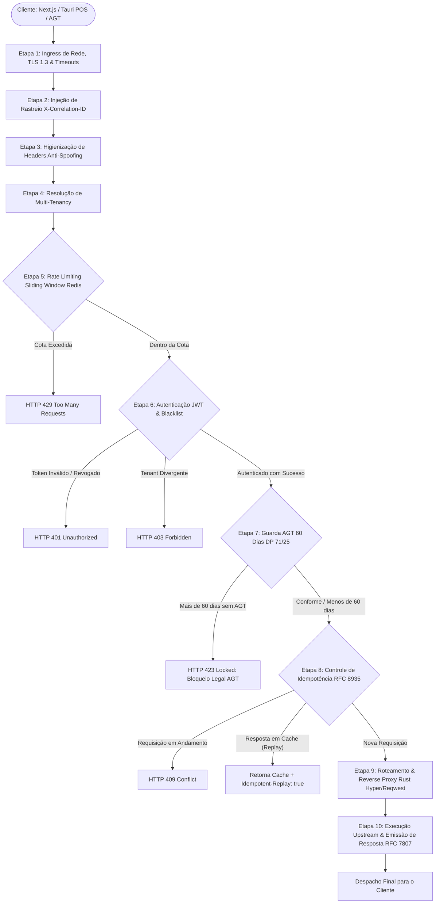

# Guia de Ciclo de Vida e Etapas do API Gateway - ERP Kudiba

**Documento:** Detalhamento Passo a Passo da Pipeline de Execução  
**Versão:** 1.0.0  
**Data:** Outubro de 2026  
**Linguagem Oficial Adotada:** Rust (Edição 2021) com Axum 0.7, Tokio e Tower  
**Normas:** RFC 7807 (Problem Details), RFC 8935 (Idempotency), Decreto Presidencial n.º 71/25 da AGT  

---

## 1. Visão Geral da Pipeline (Fluxograma Mermaid)

Cada requisição recebida pelo **API Gateway em Rust** passa por uma sequência estrita de 10 etapas encadeadas na pipeline de middlewares antes de ser despachada para os serviços internos do backend (Core API e Fiscal Engine):

---

## 2. Detalhamento e Comentário de Cada Etapa

---

### ETAPA 1: Ingress de Rede, Terminação TLS 1.3 e Configurações de Conexão
* **Localização no Código:** [`Backend/src/server.rs`](file:///mnt/c/Users/Jaime/Documents/Repos/Kudiba/Backend/src/server.rs) e [`Backend/src/config.rs`](file:///mnt/c/Users/Jaime/Documents/Repos/Kudiba/Backend/src/config.rs)
* **Objetivo:** Estabelecer canal seguro de comunicação, blindar o perímetro contra ataques volumétricos e garantir encerramento pontual de conexões inativas.
* **O que acontece nesta etapa:**
  1. **Terminação TLS 1.3:** O Gateway negocia cifras criptográficas modernas (`TLS_AES_256_GCM_SHA384` ou `TLS_CHACHA20_POLY1305_SHA256`). Conexões antigas inseguras (TLS 1.0/1.1) são rejeitadas sumariamente.
  2. **Controle de Conexões Persistentes (TCP Keep-Alive):** O runtime Tokio e o Axum mantêm keep-alive configurado para 90s, permitindo que caixas de PDV (Tauri) e aplicações Web reutilizem o mesmo socket TCP para centenas de requisições, eliminando o custo do handshake SSL a cada clique.
  3. **Limite de Tamanho do Corpo (Body Limit):** Camada `RequestBodyLimitLayer` configurada para 10MB (ou 20MB para importação SAF-T), abortando antecipadamente antes de consumir memória do pod (*Memory Exhaustion DoS*).
  4. **Timeouts Protetivos:** Camada `TimeoutLayer` de 60 segundos impede que conexões lentas prendam recursos assíncronos do Tokio (*Slowloris attacks*).

---

### ETAPA 2: Injeção de Rastreabilidade Distribuída (`X-Correlation-ID`)
* **Localização no Código:** [`Backend/src/middleware/correlation.rs`](file:///mnt/c/Users/Jaime/Documents/Repos/Kudiba/Backend/src/middleware/correlation.rs)
* **Objetivo:** Garantir observabilidade de ponta a ponta e rastreabilidade total de incidentes e auditorias fiscais.
* **O que acontece nesta etapa:**
  1. O Gateway verifica se o cliente enviou um cabeçalho `X-Correlation-ID`.
  2. Se ausente, gera imediatamente um **UUIDv4** único via crate `uuid`.
  3. Esse identificador é:
     * Adicionado aos cabeçalhos da requisição interna enviada aos serviços downstream.
     * Devolvido nos cabeçalhos de resposta HTTP para o cliente.
     * Injetado automaticamente em cada linha de log estruturado gerada pela crate `tracing`.

---

### ETAPA 3: Higienização de Segurança e Prevenção de *Header Spoofing*
* **Localização no Código:** [`Backend/src/middleware/tenant.rs`](file:///mnt/c/Users/Jaime/Documents/Repos/Kudiba/Backend/src/middleware/tenant.rs)
* **Objetivo:** Proteger a rede interna contra injeção forjada de privilégios ou contextos por clientes externos maliciosos.
* **O que acontece nesta etapa:**
  1. Qualquer cabeçalho que comece com o prefixo confiável interno (`X-Resolved-Tenant-ID`, `X-Resolved-User-ID`, `X-Resolved-Roles`) que venha da internet pública é **sumariamente apagado da requisição**.
  2. O Gateway garante que os microsserviços internos do cluster só recebam esses dados a partir dos mecanismos verificados pelo próprio Gateway nas etapas seguintes.

---

### ETAPA 4: Resolução de Multi-Tenancy (Identificação da Organização)
* **Localização no Código:** [`Backend/src/middleware/tenant.rs`](file:///mnt/c/Users/Jaime/Documents/Repos/Kudiba/Backend/src/middleware/tenant.rs)
* **Objetivo:** Descobrir a qual empresa/organização a requisição pertence no ecossistema Multi-Tenant SaaS.
* **Estratégia de Resolução Hierárquica:**
  1. **Subdomínio:** Se o cliente acessar via `empresaA.kudiba.ao`, o Gateway extrai `empresaA` como slug do tenant.
  2. **Cabeçalho `X-Tenant-ID`:** Se for um PDV de secretária (Tauri POS) ou integração externa, o identificador UUID da empresa deve vir no cabeçalho.
  3. **Rotas Públicas:** Rotas como `/health`, `/ready` e `/auth/login` são isentas de tenant prévio.
  4. Se a rota exigir tenant e nenhuma identificação válida for encontrada, o Gateway interrompe a requisição e retorna:
     * **HTTP Status:** `400 Bad Request`
     * **Código:** `TENANT_IDENTIFICATION_REQUIRED` (RFC 7807)

---

### ETAPA 5: Rate Limiting Distribuído (Sliding Window via Redis Lua)
* **Localização no Código:** [`Backend/src/middleware/ratelimit.rs`](file:///mnt/c/Users/Jaime/Documents/Repos/Kudiba/Backend/src/middleware/ratelimit.rs)
* **Objetivo:** Proteger os bancos de dados e motores fiscais contra sobrecarga, garantindo justiça de recursos entre tenants.
* **O que acontece nesta etapa:**
  1. O Gateway calcula uma chave combinada no Redis: `ratelimit:{tenant_id}:{client_ip}:{categoria_rota}`.
  2. Um **script Lua atômico** executa a remoção de requisições antigas na janela de tempo e contabiliza o número de chamadas recentes usando conjuntos ordenados (*Sorted Sets* via `ZREMRANGEBYSCORE` e `ZCARD`).
  3. **Políticas por Categoria:**
     * Rotas de Login (`/auth/*`): **10 requisições / minuto** (anti brute-force).
     * Emissão Fiscal (`/fiscal/invoices`): **120 requisições / minuto**.
     * Sincronização POS (`/sync/pos/*`): **60 requisições / minuto**.
     * Catálogo e Leitura Geral: **600 requisições / minuto**.
  4. Se a cota for excedida, responde com `429 Too Many Requests` e injeta `Retry-After: 60`.
  5. **Resiliência (Fail-Open):** Caso o cluster Redis fique temporariamente inacessível, o middleware registra um alerta via `tracing::warn!` e permite o tráfego passar sem travar as operações comerciais do cliente.

---

### ETAPA 6: Autenticação Criptográfica e Verificação de Sessão (JWT & JWKS)
* **Localização no Código:** [`Backend/src/middleware/auth.rs`](file:///mnt/c/Users/Jaime/Documents/Repos/Kudiba/Backend/src/middleware/auth.rs)
* **Objetivo:** Validar a legitimidade da requisição, autenticar o operador e aplicar isolamento estrito entre empresas.
* **O que acontece nesta etapa:**
  1. Extração do token do cabeçalho `Authorization: Bearer <token>`.
  2. **Validação Criptográfica Assimétrica:** A crate `jsonwebtoken` valida a assinatura digital em CPU em fração de microssegundo.
  3. **Verificação da Lista de Revogação Perimétrica (Blacklist):** O Gateway confere no Redis se o identificador único do token (`jti`) foi registrado como revogado (ex: logout recente ou operador desativado). Se revogado, rejeita com `401 Unauthorized`.
  4. **Validação Cruzada de Tenant (Anti-Exploração Horizontal):**
     * O Gateway confere se o `tenant_id` assinado no JWT é idêntico ao tenant identificado na Etapa 4.
     * Caso um usuário autenticado da "Empresa X" tente enviar requisições para recursos da "Empresa Y", a requisição é abortada com **`403 Forbidden` (`TENANT_CROSS_VALIDATION_FAILED`)**.
  5. **Injeção de Cabeçalhos Autenticados Seguros:** Injeta `X-Resolved-User-ID`, `X-Resolved-Tenant-ID` e `X-Resolved-Roles` antes de despachar internamente.

---

### ETAPA 7: Guarda Regulatória de Contingência AGT (Decreto Presidencial n.º 71/25)
* **Localização no Código:** [`Backend/src/middleware/contingency.rs`](file:///mnt/c/Users/Jaime/Documents/Repos/Kudiba/Backend/src/middleware/contingency.rs)
* **Objetivo:** Cumprimento rigoroso da obrigação legal angolana que manda bloquear softwares que fiquem mais de 60 dias sem comunicar com a AGT.
* **O que acontece nesta etapa:**
  1. Intercepta requisições dirigidas a endpoints de emissão de novas faturas (`POST /api/v1/fiscal/invoices`).
  2. Consulta no Redis o timestamp da última sincronização bem-sucedida daquela empresa com a Plataforma Electrónica da AGT (`fiscal:contingency:{tenant_id}:last_successful_sync`).
  3. Calcula:
     $$\Delta t = \text{Data Atual} - \text{Data da Última Sincronização AGT}$$
  4. Se $\Delta t > 60 \text{ dias}$:
     * O Gateway bloqueia o processamento antes de consumir recursos do banco de dados ou do motor de assinatura.
     * **HTTP Status:** `423 Locked`
     * **Corpo RFC 7807:** Detalha a violação do Decreto Presidencial n.º 71/25 e orienta a conexão à internet para restabelecer a comunicação.

---

### ETAPA 8: Controle Perimétrico de Idempotência (RFC 8935)
* **Localização no Código:** [`Backend/src/middleware/idempotency.rs`](file:///mnt/c/Users/Jaime/Documents/Repos/Kudiba/Backend/src/middleware/idempotency.rs)
* **Objetivo:** Impedir que oscilações de rede (típicas em redes 3G/4G em Angola) resultem em emissões duplicadas de faturas ou débitos repetidos.
* **O que acontece nesta etapa:**
  1. O cliente envia `Idempotency-Key: <UUIDv4>` ao emitir faturas ou registar pagamentos.
  2. O Gateway tenta gravar no Redis: `SET idempotency:{tenant}:{key} IN_PROGRESS NX EX 120`.
  3. **Cenário A (Primeira Tentativa):** Lock adquirido com sucesso; a requisição prossegue para o Core/Fiscal Service.
  4. **Cenário B (Tentativa Simultânea em Andamento):** Chave existe com valor `IN_PROGRESS`; retorna `409 Conflict` informando que a operação já está a ser processada.
  5. **Cenário C (Reenvio Após Sucesso):** O cliente não recebeu a resposta anterior por queda de rede e reenviou. O Gateway recupera a resposta original em cache (status HTTP, headers e JSON), devolve-a instantaneamente com o cabeçalho `Idempotent-Replay: true` e **não aciona o banco novamente**.
  6. Respostas com sucesso são mantidas no cache de idempotência por 24 horas.

---

### ETAPA 9: Roteamento Inteligente e Reverse Proxy de Alta Concorrência
* **Localização no Código:** [`Backend/src/proxy.rs`](file:///mnt/c/Users/Jaime/Documents/Repos/Kudiba/Backend/src/proxy.rs) e [`Backend/src/server.rs`](file:///mnt/c/Users/Jaime/Documents/Repos/Kudiba/Backend/src/server.rs)
* **Objetivo:** Encaminhar a requisição higienizada e autenticada para o serviço interno correto com latência mínima.
* **O que acontece nesta etapa:**
  1. O roteador Axum avalia o prefixo da URL:
     * `/api/v1/fiscal/*` $\rightarrow$ Encaminha para o **Fiscal Engine Service** (Motor Criptográfico RSA / Séries).
     * `/api/v1/*` $\rightarrow$ Encaminha para o **Core API Server**.
  2. O cliente assíncrono `reqwest::Client` utiliza connection pooling agressivo:
     * `pool_max_idle_per_host = 200`
     * `pool_idle_timeout = 90s`
     * Reutilização imediata de conexões TCP com overhead perimétrico < 0.8ms.

---

### ETAPA 10: Execução Upstream e Padronização de Respostas (RFC 7807)
* **Localização no Código:** [`Backend/src/proxy.rs`](file:///mnt/c/Users/Jaime/Documents/Repos/Kudiba/Backend/src/proxy.rs) e [`Backend/src/errors.rs`](file:///mnt/c/Users/Jaime/Documents/Repos/Kudiba/Backend/src/errors.rs)
* **Objetivo:** Capturar a resposta do serviço interno, gravar o cache de idempotência (se aplicável) e padronizar qualquer erro antes do envio ao cliente.
* **O que acontece nesta etapa:**
  1. Se o serviço upstream responder normalmente, a resposta flui em *streaming* direto para o cliente.
  2. Caso o serviço interno esteja offline, instável ou com timeout, o erro é convertido no padrão formal **RFC 7807 (`application/problem+json`)**:
     * **HTTP Status:** `502 Bad Gateway`
     * **Código:** `UPSTREAM_COMMUNICATION_ERROR`
     * Detalhes amigáveis com o identificador de correlação para abertura de chamado.

---

## 3. Resumo das Etapas e Responsabilidades

| Etapa | Componente Responsável | O que Valida / Executa | Resposta em Caso de Falha |
| :---: | :--- | :--- | :--- |
| **1** | Axum / Tokio / TLS | Terminação TLS 1.3, Timeouts, Body Limit | Conexão rejeitada / `413 Payload Too Large` |
| **2** | Middleware Correlation | Injeta / Propaga `X-Correlation-ID` | Gera novo UUID transparente |
| **3** | Middleware Tenant | Apaga headers internos `X-Resolved-*` forjados | Sanitização transparente |
| **4** | Middleware Tenant | Identifica a organização (Subdomínio / Header) | `400 Bad Request` |
| **5** | Middleware RateLimit | Cota por janela deslizante via script Redis Lua | `429 Too Many Requests` (`Retry-After: 60`) |
| **6** | Middleware Auth | Valida JWT Ed25519, checa blacklist e cruza tenant | `401 Unauthorized` ou `403 Forbidden` |
| **7** | Middleware Contingency | Bloqueia emissão fiscal se offline há > 60 dias (DP 71/25) | `423 Locked` (`AGT_CONTINGENCY_LIMIT_EXCEEDED`) |
| **8** | Middleware Idempotency | Lock atômico `Idempotency-Key` e cache por 24h | `409 Conflict` ou Replay em cache (`Idempotent-Replay`) |
| **9** | Reverse Proxy Engine | Roteamento com pool persistente (Fiscal vs Core) | `502 Bad Gateway` |
| **10** | Response Pipeline | Formatação RFC 7807, gravação de cache e logs JSON | Resposta padronizada entregue ao cliente |
