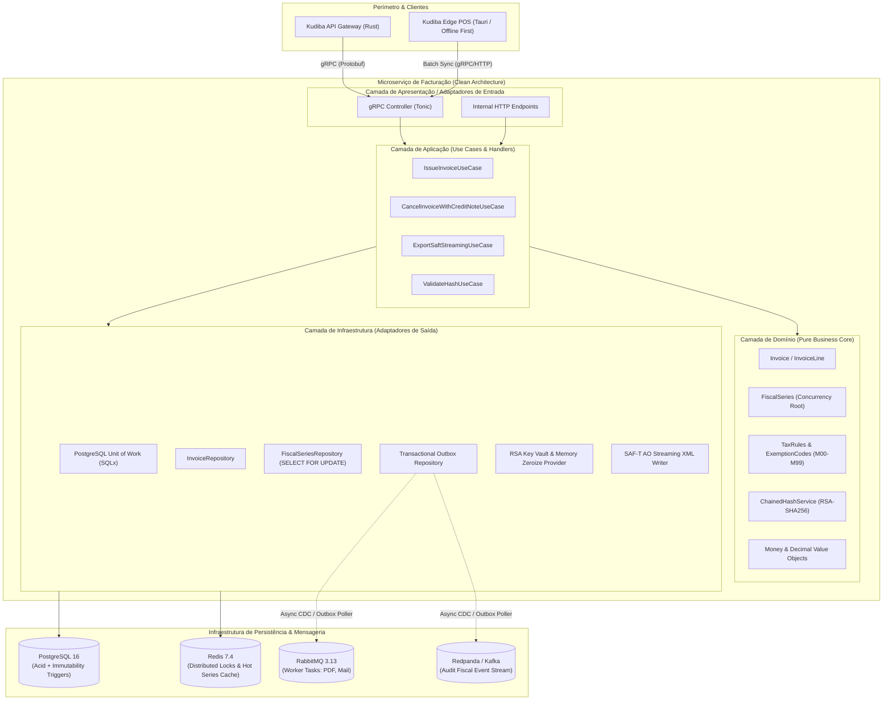
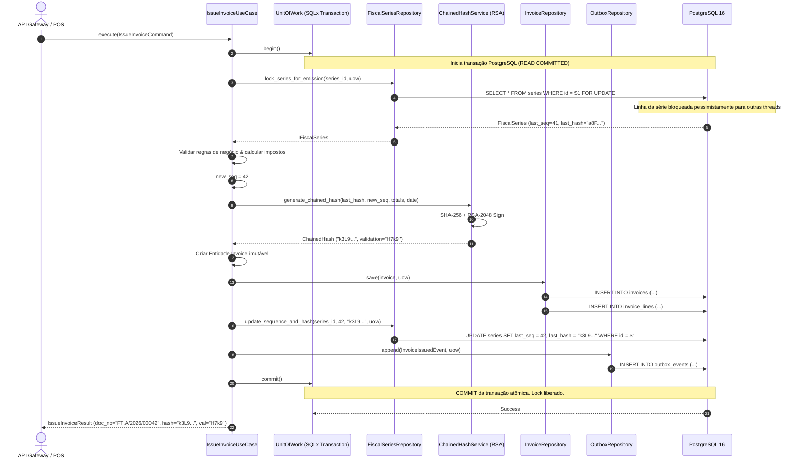

# Arquitetura e Engenharia do Microserviço de Facturação (Fiscal Engine)
## ERP Kudiba — Conformidade Integral com o Decreto Presidencial n.º 71/25 (AGT Angola)

**Documento:** Especificação Técnica de Engenharia e Arquitetura do Microserviço Fiscal  
**Versão:** 1.0.0  
**Data:** Outubro de 2026  
**Padrões Arquiteturais:** Clean Architecture (Hexagonal/Ports & Adapters), Unit of Work (UOW), Repository Pattern, Transactional Outbox, Event-Driven Architecture  
**Protocolos:** gRPC (Tonic / Protobuf) + PostgreSQL 16 ACID + AMQP/Kafka  

---

## 1. Visão Geral e Requisitos de Missão Crítica

O **Microserviço de Facturação (Fiscal Engine)** é o coração contábil e tributário do ERP Kudiba. Ele é responsável por orquestrar, assinar digitalmente, sequenciar e persistir todo e qualquer documento com relevância fiscal emitido na plataforma (Facturas `FT`, Facturas-Recibo `FR`, Facturas Pró-Forma `FP`, Notas de Crédito `NC`, Notas de Débito `ND`, Guias de Transporte `GT` e Guias de Remessa `GR`).

### 1.1 Metas e SLAs de Engenharia
- **Latência de Emissão:** $p99 < 15\text{ ms}$ por fatura (incluindo cálculo de impostos, verificação de contingência, bloqueio de concorrência, assinatura criptográfica RSA e escrita em disco).
- **Throughput:** Suporte a $> 3.500\text{ faturas/segundo}$ em cluster distribuído horizontalmente particionado por Série/Tenant.
- **Consistência Transacional:** Nível estrito ACID. Tolerância zero para saltos de numeração (*gaps*) ou duplicidade de sequência em documentos fiscais.
- **Imutabilidade Jurídica:** Uma vez emitido e assinado, nenhum documento fiscal pode sofrer `UPDATE` ou `DELETE` no banco de dados. Qualquer retificação exige a emissão legal de Nota de Crédito nos termos da AGT.

### 1.2 Conformidade com o Decreto Presidencial n.º 71/25
1. **Encadeamento Criptográfico de Hash (Chaining):**
   $$\text{Hash}_N = \text{RSA\_Sign}_{\text{PrivKey}}\Big(\text{SHA256}\big(\text{Hash}_{N-1} + \text{DataEmissao} + \text{DocNo} + \text{TotalBruto} + \text{TotalImposto}\big)\Big)$$
   - A primeira fatura da série ($N=1$) utiliza string vazia no lugar de $\text{Hash}_{N-1}$.
2. **Quatro Caracteres de Validação no Documento Impresso:**
   - Extraídos das posições 1ª, 11ª, 21ª e 31ª do hash codificado em Base64 (exemplo: `H7k9`).
3. **Monitoramento e Bloqueio de Contingência (Regra dos 60 Dias):**
   - Se o tenant operar em modo offline/desconectado da AGT por mais de 60 dias consecutivos, a emissão fiscal é bloqueada pelo motor com código HTTP `423 Locked` / Status gRPC `FAILED_PRECONDITION`.
4. **Exportação Fidedigna do SAF-T AO (XML):**
   - Geração de arquivos mensais ou anuais em conformidade com o schema XSD oficial da AGT, operando em streaming com consumo constante de memória $O(1)$.

---

## 2. Diagrama Arquitetural Geral

O diagrama abaixo ilustra o fluxo de dados e os limites arquiteturais do microserviço:



---

## 3. Arquitetura em Camadas (Clean Architecture)

A estrutura adota estritamente a **Clean Architecture** (Arquitetura Limpa), onde as regras de negócio de domínio são isoladas do banco de dados, da criptografia e dos protocolos de transporte.

```
                           +----------------------------------------+
                           |       Adaptadores de Apresentação      |
                           |  (gRPC Controllers, Proto Handlers)    |
                           +-------------------+--------------------+
                                               |
                                               v
                           +----------------------------------------+
                           |           Casos de Uso (Usecases)      |
                           |   (Commands, Queries, Application DTOs)|
                           +-------------------+--------------------+
                                               |
                                               v
                           +----------------------------------------+
                           |          Domínio (Core Puro)           |
                           | (Entities, Value Objects, Domain Serv.)|
                           +-------------------+--------------------+
                                               ^
                                               |
                           +-------------------+--------------------+
                           |        Adaptadores de Infraestrutura   |
                           | (UOW, SQLx Repos, RSA Vault, Outbox)   |
                           +----------------------------------------+
```

### 3.1 Camada de Domínio (`domain/`)
Contém a essência das regras tributárias angolanas. **Não possui qualquer dependência externa** (sem referências a frameworks web, bibliotecas SQL ou serializadores HTTP).

- **Entidades e Agregados:**
  - `FiscalSeries`: Representa a série fiscal (ex: `FT A/2026`). Atua como a **Raiz de Agregação (Aggregate Root)** da concorrência, controlando o `last_sequence_number` e o `last_document_hash`.
  - `Invoice`: O documento fiscal completo, contendo número legal, datas, cabeçalho de cliente, totais e bloco de assinatura criptográfica.
  - `InvoiceLine`: Linha do item, quantidade, preço unitário, desconto, taxa de IVA e código de isenção caso aplicável.
  - `TaxSummaryEntry`: Consolidação por taxa de IVA (ex: Geral 14%, Reduzida 5%, Isenta 0%).
- **Value Objects:**
  - `InvoiceNumber`: Valida e formata strings como `FT SERIEA/2026/00042`.
  - `Money` / `FiscalDecimal`: Precisão decimal arbitrária fixa (4 casas decimais para cálculo intermediário, 2 casas para liquidação final) impedindo erros IEEE 754.
  - `ValidationCode`: Representa os 4 caracteres de validação impressos.
  - `ChainedHash`: O hash em Base64 e os bytes binários originais da assinatura RSA.
  - `TaxExemptionReason`: Enum tipado com códigos da AGT (`M00` a `M99`) obrigatórios quando o IVA for zero.
- **Domain Services:**
  - `ChainedHashService`: Monta a string canônica da AGT e invoca a interface de assinatura digital.
  - `ContingencyValidator`: Garante que a data do documento não viole o teto de 60 dias nem seja anterior à última fatura da mesma série.
- **Portas de Saída de Domínio (Interfaces):**
  - `IInvoiceRepository`: Contrato para salvar e consultar faturas.
  - `IFiscalSeriesRepository`: Contrato para buscar e travar (*lock*) séries.
  - `IUnitOfWork`: Contrato para gerenciar a transação atômica.
  - `ICryptographicSigner`: Contrato para assinar o buffer SHA-256 com a chave privada RSA da organização.

### 3.2 Camada de Aplicação (`application/`)
Orquestra os fluxos de casos de uso sem implementar detalhes técnicos de banco ou criptografia.

- **Casos de Uso (Commands / Queries):**
  - `IssueInvoiceCommand`: Recebe o rascunho de venda, valida regras de negócio, reserva a numeração sequencial via UOW, invoca a assinatura e persiste o documento e o evento de outbox.
  - `CancelInvoiceWithCreditNoteCommand`: Gera uma Nota de Crédito referenciando a fatura retificada, mantendo a integridade do encadeamento.
  - `ExportSaftAoQuery`: Inicia a geração de SAF-T com stream reativo para clientes de auditoria.
  - `ValidateInvoiceHashQuery`: Valida se o hash e os 4 caracteres de uma fatura conferem com a chave pública do emissor.

### 3.3 Camada de Infraestrutura (`infrastructure/`)
Implementa os detalhes de baixo nível e as portas definidas pelo domínio.

- **Persistência & Repositórios:**
  - `PostgreSqlUnitOfWork`: Gerenciador de transação `sqlx::Transaction<Postgres>`.
  - `PostgreSqlInvoiceRepository`: Executa inserções em `kudiba_core.invoices` e `kudiba_core.invoice_lines`.
  - `PostgreSqlFiscalSeriesRepository`: Executa `SELECT ... FOR UPDATE` na linha da série correspondente.
  - `PostgreSqlOutboxRepository`: Insere eventos na tabela `kudiba_core.outbox_events`.
- **Criptografia & Proteção de Memória:**
  - `RsaKeyVaultSigner`: Executa a assinatura RSA PKCS#1 v1.5 com SHA-256. Utiliza a crate `zeroize` para limpar buffers de memória sensíveis imediatamente após a operação criptográfica.
- **Outbox Background Worker:**
  - Processo em segundo plano que lê eventos pendentes da tabela outbox e despacha para o RabbitMQ (tarefas de envio de e-mail e renderização de PDF) e Kafka (tópico imutável de auditoria tributária).
- **Streaming SAF-T XML:**
  - Implementação via `quick-xml` (Rust) que lê lotes de faturas do PostgreSQL usando cursores e grava diretamente no buffer de saída gRPC/HTTP em chunks de 64KB, garantindo consumo de RAM estável (< 50MB) mesmo para 500.000 faturas.

### 3.4 Camada de Apresentação (`presentation/`)
- Controladores gRPC implementando o contrato [`proto/fiscal/v1/fiscal_engine.proto`](file:///mnt/c/Users/Jaime/Documents/Repos/Kudiba/proto/fiscal/v1/fiscal_engine.proto).
- Tratamento de erros canônicos e tradução para códigos gRPC (`InvalidArgument`, `FailedPrecondition`, `Aborted`).

---

## 4. O Padrão Unit of Work (UOW) e Repository Pattern em Detalhes

### 4.1 O Desafio da Sequencialidade e Concorrência da AGT
O Decreto Presidencial n.º 71/25 exige que:
1. Dentro de cada série fiscal, a numeração seja rigorosamente contínua ($1, 2, 3, \dots$).
2. Cada fatura $N$ contenha o hash da fatura $N-1$.
3. Se duas requisições de emissão para a mesma série chegarem no mesmo milissegundo, elas **devem ser estritamente serializadas**, sem gerar colisão de números e sem saltar sequências se uma delas falhar.

### 4.2 Ciclo de Vida da Transação com UOW



### 4.3 Por que o UOW é Indispensável Aqui?
- **Atomicidade Total:** O incremento da série, a gravação da fatura, as linhas de item e o evento de outbox são gravados no mesmo *commit* do PostgreSQL.
- **Rollback Transacional Seguro:** Se a chave de criptografia falhar, se o banco acusar violação de integridade ou se a validação tributária recusar o documento, o `ROLLBACK` cancela todo o bloco: a série volta para o número anterior, nenhum buraco é criado e o evento de outbox não é gravado.

---

## 5. Modelo de Dados Relacional e Triggers de Imutabilidade

### 5.1 Esquema DDL Otimizado (PostgreSQL 16)

```sql
-- =============================================================================
-- ESQUEMA FISCAL KUDIBA ERP - COMPATIBILIDADE DECRETO PRESIDENCIAL N.º 71/25
-- =============================================================================

CREATE SCHEMA IF NOT EXISTS kudiba_fiscal;

-- 1. Tabela de Séries Fiscais (Root de Concorrência e Bloqueio)
CREATE TABLE kudiba_fiscal.fiscal_series (
    id UUID PRIMARY KEY DEFAULT gen_random_uuid(),
    tenant_id UUID NOT NULL,
    series_code VARCHAR(20) NOT NULL,            -- Ex: 'A', 'POS01', 'SEDE'
    document_type VARCHAR(10) NOT NULL,          -- 'FT', 'FR', 'FP', 'NC', 'ND', 'GT'
    fiscal_year INTEGER NOT NULL,                -- 2026
    current_sequence BIGINT NOT NULL DEFAULT 0,  -- Sequência atual
    last_document_hash VARCHAR(512) NOT NULL DEFAULT '', -- Hash da última fatura emitida
    rsa_key_fingerprint VARCHAR(128) NOT NULL,   -- Identificador da chave privada
    is_active BOOLEAN NOT NULL DEFAULT TRUE,
    created_at TIMESTAMPTZ NOT NULL DEFAULT NOW(),
    updated_at TIMESTAMPTZ NOT NULL DEFAULT NOW(),

    CONSTRAINT uq_series_per_tenant UNIQUE (tenant_id, document_type, series_code, fiscal_year)
);

CREATE INDEX idx_fiscal_series_lookup 
ON kudiba_fiscal.fiscal_series (tenant_id, document_type, series_code, fiscal_year) 
WHERE is_active = TRUE;

-- 2. Tabela Mestra de Documentos Fiscais (Imutável pós-emissão)
CREATE TABLE kudiba_fiscal.invoices (
    id UUID PRIMARY KEY DEFAULT gen_random_uuid(),
    tenant_id UUID NOT NULL,
    series_id UUID NOT NULL REFERENCES kudiba_fiscal.fiscal_series(id),
    document_type VARCHAR(10) NOT NULL,          -- 'FT', 'FR', 'NC', etc.
    series_code VARCHAR(20) NOT NULL,
    fiscal_year INTEGER NOT NULL,
    sequence_number BIGINT NOT NULL,
    document_number VARCHAR(50) NOT NULL,        -- 'FT A/2026/00001'
    
    -- Datas de auditoria tributária
    issue_date DATE NOT NULL,
    system_entry_date TIMESTAMPTZ NOT NULL DEFAULT NOW(),
    
    -- Dados do Adquirente (Cliente)
    customer_nif VARCHAR(30) NOT NULL,           -- 'Consumidor Final' ou NIF da empresa
    customer_name VARCHAR(255) NOT NULL,
    customer_address TEXT,
    
    -- Valores Monetários (Precisão Fixa Decimal)
    gross_total NUMERIC(18, 2) NOT NULL,         -- Total Bruto
    discount_total NUMERIC(18, 2) NOT NULL DEFAULT 0.00,
    net_total NUMERIC(18, 2) NOT NULL,           -- Base Tributável
    tax_total NUMERIC(18, 2) NOT NULL,           -- Total de Imposto Liquidado
    payable_amount NUMERIC(18, 2) NOT NULL,      -- Total a Pagar
    
    -- Bloco Criptográfico do Decreto Presidencial n.º 71/25
    previous_hash VARCHAR(512) NOT NULL,         -- Hash do documento N-1
    document_hash VARCHAR(512) NOT NULL,         -- Hash RSA-SHA256 (Base64) deste documento
    validation_code VARCHAR(10) NOT NULL,        -- 4 Caracteres (1ª, 11ª, 21ª, 31ª posições)
    hash_control_version VARCHAR(10) NOT NULL DEFAULT '1.0',
    rsa_key_version VARCHAR(20) NOT NULL,
    
    -- Estado e Contingência
    status VARCHAR(20) NOT NULL DEFAULT 'ISSUED', -- 'ISSUED', 'CANCELLED_BY_CREDIT_NOTE'
    is_contingency BOOLEAN NOT NULL DEFAULT FALSE,
    contingency_reason TEXT,
    
    CONSTRAINT uq_invoice_sequence_strict UNIQUE (tenant_id, document_type, series_code, fiscal_year, sequence_number)
);

CREATE INDEX idx_invoices_tenant_date ON kudiba_fiscal.invoices (tenant_id, issue_date DESC);
CREATE INDEX idx_invoices_doc_number ON kudiba_fiscal.invoices (tenant_id, document_number);

-- 3. Linhas da Factura (Detalhes de Itens)
CREATE TABLE kudiba_fiscal.invoice_lines (
    id UUID PRIMARY KEY DEFAULT gen_random_uuid(),
    invoice_id UUID NOT NULL REFERENCES kudiba_fiscal.invoices(id) ON DELETE RESTRICT,
    line_number INTEGER NOT NULL,
    product_code VARCHAR(50) NOT NULL,
    product_description VARCHAR(255) NOT NULL,
    quantity NUMERIC(14, 4) NOT NULL,
    unit_price NUMERIC(18, 4) NOT NULL,
    discount_amount NUMERIC(18, 2) NOT NULL DEFAULT 0.00,
    net_amount NUMERIC(18, 2) NOT NULL,
    
    -- IVA e Isenção AGT
    tax_type VARCHAR(10) NOT NULL DEFAULT 'IVA',
    tax_percentage NUMERIC(5, 2) NOT NULL,       -- 14.00, 5.00, 0.00
    tax_amount NUMERIC(18, 2) NOT NULL,
    tax_exemption_code VARCHAR(10),              -- 'M02', 'M04', etc.
    tax_exemption_reason VARCHAR(255),
    
    CONSTRAINT uq_invoice_line_num UNIQUE (invoice_id, line_number)
);

-- 4. Tabela de Transactional Outbox (Mensageria Desacoplada e Confiável)
CREATE TABLE kudiba_fiscal.outbox_events (
    id UUID PRIMARY KEY DEFAULT gen_random_uuid(),
    aggregate_type VARCHAR(50) NOT NULL,         -- 'INVOICE'
    aggregate_id VARCHAR(100) NOT NULL,          -- invoice_id
    event_type VARCHAR(100) NOT NULL,            -- 'InvoiceIssuedEvent'
    payload JSONB NOT NULL,
    created_at TIMESTAMPTZ NOT NULL DEFAULT NOW(),
    processed_at TIMESTAMPTZ,
    retry_count INTEGER NOT NULL DEFAULT 0,
    status VARCHAR(20) NOT NULL DEFAULT 'PENDING'-- 'PENDING', 'SENT', 'FAILED'
);

CREATE INDEX idx_outbox_pending 
ON kudiba_fiscal.outbox_events (status, created_at ASC) 
WHERE status = 'PENDING';
```

### 5.2 Trigger de Proteção e Imutabilidade Fiduciária
Para blindar o banco de dados contra intervenções manuais ou queries acidentais de `UPDATE` e `DELETE`:

```sql
CREATE OR REPLACE FUNCTION kudiba_fiscal.fn_enforce_invoice_immutability()
RETURNS TRIGGER AS $$
BEGIN
    -- Permitir apenas atualização de status administrativo via use case autorizado
    IF TG_OP = 'UPDATE' THEN
        IF OLD.document_hash IS NOT NULL AND (
            NEW.document_hash <> OLD.document_hash OR 
            NEW.sequence_number <> OLD.sequence_number OR
            NEW.payable_amount <> OLD.payable_amount OR
            NEW.issue_date <> OLD.issue_date
        ) THEN
            RAISE EXCEPTION 'VIOLACAO_FISCAL_AGT: Documentos fiscais assinados são imutáveis (Decreto Presidencial 71/25). Alteração proibida na fatura ID: %', OLD.id;
        END IF;
        RETURN NEW;
    ELSIF TG_OP = 'DELETE' THEN
        RAISE EXCEPTION 'VIOLACAO_FISCAL_AGT: É estritamente proibido excluir faturas emitidas da base de dados. Fatura ID: %', OLD.id;
    END IF;
    RETURN NULL;
END;
$$ LANGUAGE plpgsql;

CREATE TRIGGER trg_invoice_immutability
BEFORE UPDATE OR DELETE ON kudiba_fiscal.invoices
FOR EACH ROW EXECUTE FUNCTION kudiba_fiscal.fn_enforce_invoice_immutability();
```

---

## 6. Estrutura de Pastas do Microserviço

Seguindo a Clean Architecture em Rust:

```
fiscal-engine/
├── Cargo.toml
├── proto/
│   └── fiscal/v1/fiscal_engine.proto      # Contratos gRPC
├── build.rs                              # Compilador de Protobuf (tonic-build)
└── src/
    ├── main.rs                           # Entrypoint, injeção de dependências e graceful shutdown
    │
    ├── domain/                           # Camada 1: Regras de Negócio e Entidades Puras
    │   ├── mod.rs
    │   ├── entities/
    │   │   ├── invoice.rs                # Agregado Invoice e InvoiceLine
    │   │   ├── fiscal_series.rs          # Agregado FiscalSeries (Concurrency Root)
    │   │   └── tax_entry.rs              # Regras de IVA e Isenções AGT
    │   ├── value_objects/
    │   │   ├── money.rs                  # Aritmética decimal de precisão fixa
    │   │   ├── invoice_number.rs         # Validador de número legal (FT A/2026/00001)
    │   │   ├── chained_hash.rs           # Representação do Hash SHA-256 / Base64
    │   │   └── validation_code.rs        # 4 Caracteres (1ª, 11ª, 21ª, 31ª posições)
    │   ├── services/
    │   │   ├── hash_calculator.rs        # Montagem canônica da string tributária
    │   │   └── contingency_rules.rs      # Validador da regra de teto dos 60 dias
    │   └── ports/
    │       ├── invoice_repository.rs     # Interface de persistência da fatura
    │       ├── series_repository.rs      # Interface de consulta e lock de séries
    │       ├── unit_of_work.rs           # Interface transacional do UOW
    │       └── crypto_signer.rs          # Interface para assinar buffers RSA
    │
    ├── application/                      # Camada 2: Orquestração e Casos de Uso
    │   ├── mod.rs
    │   ├── dtos/
    │   │   ├── issue_invoice_request.rs
    │   │   └── issue_invoice_response.rs
    │   ├── commands/
    │   │   ├── issue_invoice.rs          # IssueInvoiceUseCase
    │   │   └── cancel_invoice.rs         # CancelInvoiceUseCase (via Nota de Crédito)
    │   └── queries/
    │       ├── export_saft.rs            # Geração de streaming XML do SAF-T AO
    │       └── validate_hash.rs          # Validação de integridade pública de hash
    │
    ├── infrastructure/                   # Camada 3: Adaptadores de Entrada/Saída
    │   ├── mod.rs
    │   ├── persistence/
    │   │   ├── postgres_uow.rs           # Implementação concreta do UOW em SQLx
    │   │   ├── postgres_invoice_repo.rs  # Repositório concreto de faturas
    │   │   ├── postgres_series_repo.rs   # Repositório com SELECT FOR UPDATE
    │   │   └── postgres_outbox_repo.rs   # Gravação atômica no Outbox
    │   ├── crypto/
    │   │   ├── rsa_signer.rs             # Assinador RSA-SHA256 com zeroize
    │   │   └── key_vault.rs              # Cache e carregamento seguro de chaves
    │   ├── saft/
    │   │   └── saft_streamer.rs          # Gerador XML em streaming com quick-xml
    │   └── outbox/
    │       └── outbox_worker.rs          # Poller/Dispatcher para RabbitMQ/Kafka
    │
    └── presentation/                     # Camada 4: Portas de Entrada (gRPC)
        ├── mod.rs
        ├── grpc/
        │   ├── fiscal_controller.rs      # Implementação dos RPCs da API
        │   └── error_mapping.rs          # Tradução de DomainError para status gRPC
        └── interceptors/
            ├── auth_interceptor.rs       # Validação de mTLS interno
            └── correlation.rs            # Propagação de X-Correlation-ID
```

---

## 7. Implementação do Código de Referência

Abaixo demonstram-se as interfaces centrais de Clean Architecture e Unit of Work:

### 7.1 Interface do Unit of Work e Repositórios (`domain/ports/`)

```rust
use async_trait::async_trait;
use crate::domain::entities::{invoice::Invoice, fiscal_series::FiscalSeries};
use crate::domain::value_objects::chained_hash::ChainedHash;
use uuid::Uuid;

#[derive(Debug, thiserror::Error)]
pub enum RepositoryError {
    #[error("Série fiscal {0} não encontrada")]
    SeriesNotFound(Uuid),
    #[error("Conflito de concorrência na série: {0}")]
    ConcurrencyConflict(String),
    #[error("Erro de persistência de banco de dados: {0}")]
    DatabaseError(String),
}

#[async_trait]
pub trait IFiscalSeriesRepository: Send + Sync {
    /// Obtém a série fiscal aplicando bloqueio pessimista (SELECT ... FOR UPDATE)
    async fn lock_series_for_emission(
        &mut self,
        tenant_id: Uuid,
        doc_type: &str,
        series_code: &str,
        year: i32,
    ) -> Result<FiscalSeries, RepositoryError>;

    /// Atualiza a sequência atual e o hash encadeado na mesma transação
    async fn update_sequence_and_hash(
        &mut self,
        series_id: Uuid,
        new_sequence: i64,
        new_hash: &ChainedHash,
    ) -> Result<(), RepositoryError>;
}

#[async_trait]
pub trait IInvoiceRepository: Send + Sync {
    /// Grava a fatura e todas as suas linhas de itens na transação ativa
    async fn save(&mut self, invoice: &Invoice) -> Result<(), RepositoryError>;
}

#[async_trait]
pub trait IOutboxRepository: Send + Sync {
    /// Insere o evento fiscal na tabela outbox dentro da transação atômica
    async fn append_event(
        &mut self,
        aggregate_type: &str,
        aggregate_id: &str,
        event_type: &str,
        payload: serde_json::Value,
    ) -> Result<(), RepositoryError>;
}

#[async_trait]
pub trait IUnitOfWork: Send + Sync {
    /// Repositório de séries amarrado à transação atual
    fn series_repo(&mut self) -> &mut dyn IFiscalSeriesRepository;
    
    /// Repositório de faturas amarrado à transação atual
    fn invoice_repo(&mut self) -> &mut dyn IInvoiceRepository;

    /// Repositório de outbox amarrado à transação atual
    fn outbox_repo(&mut self) -> &mut dyn IOutboxRepository;

    /// Comita atomicamente todas as alterações feitas nos repositórios
    async fn commit(self: Box<Self>) -> Result<(), RepositoryError>;

    /// Aborta e reverte todas as alterações em caso de erro
    async fn rollback(self: Box<Self>) -> Result<(), RepositoryError>;
}
```

### 7.2 Implementação do Caso de Uso (`application/commands/issue_invoice.rs`)

```rust
use std::sync::Arc;
use crate::domain::ports::{IUnitOfWork, crypto_signer::ICryptographicSigner};
use crate::domain::services::hash_calculator::ChainedHashCalculator;
use crate::domain::entities::invoice::Invoice;
use crate::application::dtos::issue_invoice_request::IssueInvoiceCommand;
use crate::application::dtos::issue_invoice_response::IssueInvoiceResult;

pub struct IssueInvoiceUseCase {
    uow_factory: Arc<dyn Fn() -> Box<dyn IUnitOfWork> + Send + Sync>,
    signer: Arc<dyn ICryptographicSigner>,
}

impl IssueInvoiceUseCase {
    pub fn new(
        uow_factory: Arc<dyn Fn() -> Box<dyn IUnitOfWork> + Send + Sync>,
        signer: Arc<dyn ICryptographicSigner>,
    ) -> Self {
        Self { uow_factory, signer }
    }

    pub async fn execute(&self, cmd: IssueInvoiceCommand) -> Result<IssueInvoiceResult, DomainError> {
        // 1. Inicia o Unit of Work (Abre a transação ACID no PostgreSQL)
        let mut uow = (self.uow_factory)();

        // 2. Bloqueia pessimistamente a série fiscal solicitada (SELECT FOR UPDATE)
        let mut series = uow
            .series_repo()
            .lock_series_for_emission(cmd.tenant_id, &cmd.doc_type, &cmd.series_code, cmd.fiscal_year)
            .await
            .map_err(|e| DomainError::SeriesLockFailed(e.to_string()))?;

        // 3. Verifica regra legal de contingência dos 60 dias (Decreto 71/25)
        series.assert_can_emit_at(cmd.issue_date)?;

        // 4. Reserva a próxima sequência contínua (sem furos)
        let next_seq = series.current_sequence + 1;
        let doc_number = format!("{}-{}/{}/{}", cmd.doc_type, cmd.series_code, cmd.fiscal_year, next_seq);

        // 5. Calcula a assinatura criptográfica RSA-SHA256 encadeada
        let canonical_string = ChainedHashCalculator::build_canonical_buffer(
            &series.last_document_hash,
            cmd.issue_date,
            &doc_number,
            cmd.gross_total,
            cmd.tax_total,
        );

        let signature_block = self.signer.sign(&canonical_string, &series.rsa_key_fingerprint).await?;
        let validation_code = signature_block.extract_four_chars(); // 1ª, 11ª, 21ª, 31ª posições

        // 6. Constrói a Entidade de Domínio da Fatura
        let invoice = Invoice::new(
            cmd.tenant_id,
            series.id,
            &cmd.doc_type,
            &cmd.series_code,
            cmd.fiscal_year,
            next_seq,
            doc_number.clone(),
            cmd.issue_date,
            cmd.customer,
            cmd.items,
            cmd.gross_total,
            cmd.tax_total,
            cmd.payable_amount,
            series.last_document_hash.clone(),
            signature_block.hash_base64.clone(),
            validation_code.clone(),
        )?;

        // 7. Persiste a fatura no banco via InvoiceRepository
        uow.invoice_repo().save(&invoice).await?;

        // 8. Atualiza o ponteiro de sequência e hash da série fiscal
        uow.series_repo()
            .update_sequence_and_hash(series.id, next_seq, &signature_block.hash_base64)
            .await?;

        // 9. Grava o evento na tabela Transactional Outbox (Mesma transação)
        let event_payload = serde_json::to_value(&invoice)?;
        uow.outbox_repo()
            .append_event("INVOICE", &invoice.id.to_string(), "InvoiceIssuedEvent", event_payload)
            .await?;

        // 10. Commit Atômico da Transação (Libera o LOCK da série)
        uow.commit().await.map_err(|e| DomainError::CommitFailed(e.to_string()))?;

        // 11. Retorna o comprovante fiscal imediato ao cliente
        Ok(IssueInvoiceResult {
            invoice_id: invoice.id,
            document_number: doc_number,
            sequence_number: next_seq,
            document_hash: signature_block.hash_base64,
            validation_code,
            issue_date: cmd.issue_date,
            payable_amount: cmd.payable_amount,
        })
    }
}
```

---

## 8. Estratégias de Escalabilidade e Desempenho

### 8.1 Eliminação do Gargalo de Lock por Série
Em sistemas ERP fiscais tradicionais, o `SELECT ... FOR UPDATE` na série fiscal pode virar um gargalo de concorrência se todo o sistema tentar emitir na mesma série `A`.
- **Estratégia Kudiba:** O sistema incentiva e suporta **particionamento de séries por Ponto de Venda (POS)**:
  - Caixa 01 emite na série `POS01/2026`
  - Caixa 02 emite na série `POS02/2026`
  - Faturamento Online emite na série `WEB/2026`
- **Resultado:** O bloqueio de concorrência opera de forma totalmente independente por caixa. Cem lojas simultâneas podem emitir simultaneamente no mesmo milissegundo com zero contenção de locks na base de dados.

### 8.2 Desacoplamento Assíncrono com Transactional Outbox
A rota gRPC `EmitInvoice` síncrona **não renderiza PDFs nem envia e-mails**. Ela apenas assina, grava o documento e fecha a transação com a gravação no `outbox_events` em menos de 8 milissegundos.
- Um worker assíncrono em background lê o outbox e dispara as tarefas secundárias via **RabbitMQ** (para workers de geração de PDF / envio de e-mails) e **Kafka / Redpanda** (para o log imutável de auditoria fiscal).

### 8.3 Streaming de SAF-T AO (O(1) Memory Usage)
Na exportação do arquivo anual SAF-T AO (que frequentemente ultrapassa centenas de megabytes de XML):
- A query no PostgreSQL usa cursores (`CURSOR WITH HOLD` ou batches de 1.000 faturas via SQLx streaming).
- Os nós XML são gravados diretamente no buffer de saída da conexão gRPC ou HTTP via `quick-xml`.
- O container mantém uso de memória plano em ~30MB, sem risco de encerramento por *Out-Of-Memory (OOM)*.

---

## 9. Próximos Passos de Desenvolvimento

1. **Configuração do Crate e Dependências:**
   - Adicionar `tonic`, `prost`, `sqlx` (com runtime `tokio-rustls`), `rsa`, `sha2`, `zeroize`, `rust_decimal` e `quick-xml`.
2. **Implementação da Criptografia RSA de Produção:**
   - Suporte a chaves RSA PKCS#8 de 2048 bits com senha ou integração via HashiCorp Vault.
3. **Compilação e Conexão via Docker:**
   - Adicionar o serviço `fiscal-engine` real (em Rust nativo) no `docker-compose.yml`, conectando-o ao `postgres` e expondo a porta gRPC `:9090`.
4. **Testes de Integração de Estresse:**
   - Teste de carga concorrente (100 requisições simultâneas por série) para comprovar a inexistência de duplicidade ou saltos de sequência.
