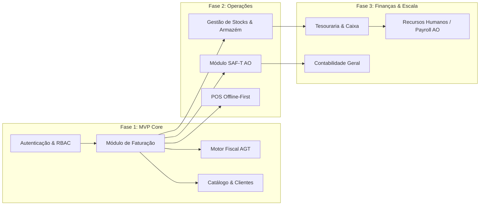

# Especificação Técnica de Engenharia: ERP de Nova Geração (Mercado Angolano)

**Versão do Documento:** 1.0.0  
**Data:** 30 de Setembro de 2026  
**Estado:** Proposta de Arquitetura & Especificação Técnica  
**Alvo Primário:** Angola / Mercados Regulados da África Subsaariana  

---

## 1. Visão Executiva & Proposta de Valor (Diferenciais Competitivos)

Os ERPs dominantes em Angola (Primavera/Cegid, PHC, Sage) foram idealizados no paradigma Desktop/Client-Server (anos 1990/2000) e adaptados posteriormente para a Web através de camadas legadas. Isso acarreta infraestruturas pesadas (dependência de Microsoft SQL Server e Windows Server), custos elevados de licenciamento e manutenção, interfaces pouco ergonómicas e APIs rígidas para integração externa.

### Nossas Valências vs. ERPs Existentes

| Vetor de Análise | ERPs Tradicionais (Primavera, PHC, Sage) | Nosso ERP (Cloud-Native / Edge-Ready) |
| :--- | :--- | :--- |
| **Arquitetura Base** | Monolítica / Client-Server adaptada para Web. | *Modular Monolith* distribuído via Event-Driven Architecture, desacoplado e containerizado. |
| **Infraestrutura e Custos** | Exigência frequente de Windows Server e MS SQL Server (licenças caras em USD/EUR). | 100% Open-Source stack (Linux, PostgreSQL, Redis), reduzindo o TCO (*Total Cost of Ownership*) em mais de 60%. |
| **Resiliência de Rede (Offline)** | Operações dependentes de ligação local de rede (LAN) ou conexões VPN lentas e instáveis. | **Edge-First / Local-First POS**: opera autonomamente sem internet e sincroniza por CRDTs / fila de eventos assim que restabelecida a rede. |
| **Conformidade Fiscal AGT** | Módulo rígido, atualizações manuais ou via patches demorados. | Motor Fiscal isolado (*Fiscal Engine Service*) como microsserviço/biblioteca imutável, auditável e preparado para CI/CD regulatório. |
| **Experiência do Utilizador (UX)** | Interfaces densas, lentas e com excesso de janelas modais. | SPA reativa, *keyboard-first* (atalhos eficientes para operadores de caixa e faturistas), latência de interação < 100ms. |
| **Extensibilidade e Integrações** | APIs SOAP/COM proprietárias e lentas. | RESTful / gRPC com OpenAPI (Swagger) e Webhooks nativos para ligação direta com bancos, fintechs locais (ex: Multicaixa GPO) e CRMs. |

---

## 2. Requisitos Regulatórios e Legais (AGT - Angola)

O sistema deve nascer em conformidade rigorosa com a legislação da **AGT (Administração Geral Tributária)** para validação e certificação de software de faturação:

1. **Assinatura Digital RSA em Cadeia:**
   * Geração de chaves RSA (tamanho mínimo 1024 bits / recomendado 2048 bits).
   * Cálculo de hash com algoritmo SHA-1 / SHA-256 encadeado:
     $$\text{DocumentHash} = \text{Sign}_{PrivKey}(\text{DataEmissao} + ";" + \text{DataGravacao} + ";" + \text{NumeroDoc} + ";" + \text{TotalBruto} + ";" + \text{HashAnterior})$$
   * Impressão clara dos 4 caracteres de validação (1º, 11º, 21º e 31º caracteres do hash) nas faturas.
2. **Imutabilidade e Numeração Estrita:**
   * Séries documentais sequenciais, sem lacunas (*gaps*) e sem sobreposição cronológica.
   * Proibição total de `UPDATE` ou `DELETE` em registos fiscais emitidos. Retificações obrigatórias através de Notas de Crédito / Débito.
3. **Mapeamento de Impostos:**
   * IVA (Taxa normal 14%, taxas reduzidas, regimes de isenção e menções obrigatórias de código de motivo de isenção no SAF-T).
   * Imposto de Selo e Retenções na Fonte (ex: prestação de serviços a 6.5%).
4. **SAF-T (AO):**
   * Motor de extração otimizado para gerar ficheiros XML em conformidade com o XSD oficial `SAFT_AO_1.01.xsd`.

---

## 3. Arquitetura de Sistema Recomendada

Para assegurar **escalabilidade horizontal**, **desempenho sub-segundo** e **facilidade de manutenção**, adota-se o padrão **Modular Monolith** com preparação para Microsserviços e processamento assíncrono via eventos.

### Diagrama Estrutural da Arquitetura

```
                         [ CLIENTES & INTEGRAÇÕES ]
                +---------------------+---------------------+
                |                     |                     |
          Next.js Web SPA       Desktop / POS         APIs Externas
          (Gestão / Backoffice)  (Tauri / Local-First) (Banca / E-commerce)
                |                     |                     |
                +---------------------+---------------------+
                                      | HTTPS / WSS / gRPC
                                      v
                          [ API GATEWAY / REVERSE PROXY ]
                         (Nginx / Traefik / Envoy + TLS)
                                      |
       +------------------------------+------------------------------+
       |                                                             |
       v                                                             v
[ CORE API SERVER ]                                       [ WORKERS & TASKS ]
* Autenticação & RBAC (JWT)                               * Geração de Relatórios Pesados
* Motor de Vendas & Faturação                             * Processamento e Validação SAF-T
* Gestão de Stocks / Inventário                           * Disparo de Emails / Notificações
* Motor Fiscal Criptográfico (RSA)                        * Sincronização de Dados POS
       |                                                             ^
       |------------- Event Bus (Redis Streams / RabbitMQ) ----------|
       |
       v
+--------------------------------------------------------------------+
|                         CAMADA DE DADOS                            |
|                                                                    |
|  +------------------------------+   +---------------------------+  |
|  |       PostgreSQL 16+         |   |      Redis Cache          |  |
|  | - Transações ACID estritas   |   | - Sessões & Tokens        |  |
|  | - Row-Level Security (RLS)   |   | - Lock distribuído p/     |  |
|  | - Triggers de auditoria      |   |   séries documentais      |  |
|  | - Tabelas de partição anual  |   | - Filas de background     |  |
|  +------------------------------+   +---------------------------+  |
+--------------------------------------------------------------------+
```

### Decisões Arquiteturais Chave (ADRs)

1. **Modular Monolith vs. Microservices Prematuros:**
   * Evita a sobrecarga de rede, complexidade de transações distribuídas (Sagas) e custos elevados no arranque. O código é estruturado em módulos internos isolados (Domain-Driven Design - DDD) com contratos de interfaces estritos.
2. **Concorrência e Séries Numéricas:**
   * Para evitar falhas em emissões simultâneas de faturas, a numeração sequencial utiliza locks atómicos ao nível de linha (`SELECT ... FOR UPDATE` no PostgreSQL) ou locks distribuídos via Redis, garantindo integridade ACID absoluta.
3. **Multi-Tenancy (SaaS):**
   * Padrão **Schema-per-Tenant** ou **Shared Database com Row-Level Security (RLS)** do PostgreSQL. RLS oferece maior eficiência de recursos mantendo isolamento lógico estrito por organização.

---

## 4. Stack Tecnológica Sugerida

### 4.1 Backend (Core Engine & APIs)
* **Linguagem:** **Go (Golang)** ou **C# (.NET 8/9 LTS)**.
  * *Racional:* Compilados para código nativo, baixíssimo consumo de memória, concorrência nativa (goroutines / async/await), e tipagem estática que previne erros numéricos e transacionais.
  * *Alternativa ágil:* **NestJS (TypeScript)** com Fastify para equipas com perfil full-stack TS.
* **Segurança Criptográfica:** Bibliotecas nativas Crypto (para geração de chaves RSA e assinatura SHA-256).

### 4.2 Camada de Persistência & Cache
* **Base de Dados Primária:** **PostgreSQL 16+**
  * Suporte robusto a transações ACID, extensões de partição por data (crítico para faturas e linhas de histórico), e campos JSONB para dados dinâmicos.
* **Cache & Mensajeria Leve:** **Redis 7+**
  * Para gestão de sessões, caching de catálogos e barramento de eventos (Redis Streams).

### 4.3 Frontend & Experiência de Utilizador
* **Backoffice & Gestão Web:** **Next.js 14+ (React)** ou **Vue 3 / Nuxt 3**
  * Componentes com **Tailwind CSS** e **shadcn/ui** (focado em acessibilidade, densidade visual e suporte total a navegação por teclado).
  * Gestão de estado cliente com **TanStack Query (React Query)** para caching reativo de requisições.
* **Ponto de Venda (POS) Offline/Edge:** **Tauri** (Rust + Web Frontend)
  * Aplicação de secretária ultraleve (< 15MB) que consome SQLite local para faturar offline e sincroniza com o servidor central quando online.

### 4.4 Infraestrutura, DevOps & CI/CD
* **Contentores:** Docker & Docker Compose para desenvolvimento; Kubernetes (K8s) ou Nomad para produção orquestrada.
* **Observabilidade:** Prometheus + Grafana para métricas de sistema; OpenTelemetry e Loki para rastreio e recolha de logs centralizados.
* **CI/CD:** GitHub Actions / GitLab CI com suites automatizadas de testes unitários, testes de carga (k6) e testes de conformidade com schemas XSD da AGT.

---

## 5. Módulos Iniciais (MVP e Fases Seguintes)



### Fase 1: MVP Core Comercial (Duração Estimada: 3 - 4 Meses)
1. **Configurações Gerais & Entidades:**
   * Gestão de Empresas/Filiais (Multi-empresa).
   * Cadastro de Artigos (produtos físicos, serviços, unidades de medida, impostos associados).
   * Cadastro de Clientes e Fornecedores com validação de NIF angolano.
2. **Motor de Faturação & Vendas:**
   * Documentos: Faturas (FT), Faturas-Recibo (FR), Faturas Pró-Forma (FP), Notas de Crédito (NC) e Notas de Débito (ND).
   * Gestão de Séries e Numeração Contínua.
   * Regras fiscais: IVA (14%, regimes de isenção com motivos legais) e Retenção na Fonte de 6.5%.
3. **Fiscal Engine (Assinatura RSA):**
   * Módulo isolado de criptografia.
   * Renderização de faturas em formato PDF A4 e Ticket Térmico (80mm) com hash legível e menção da certificação.

### Fase 2: Gestão de Inventário, SAF-T e PDV (Duração: 3 Meses)
1. **Stocks & Logística:**
   * Múltiplos armazéns, transferências entre lojas e inventário físico.
   * Custo Médio Ponderado (CMP).
   * Guias de Transporte (GT) e Guias de Remessa (GR).
2. **Exportador e Validador SAF-T (AO):**
   * Motor de geração XML otimizado via *streaming* (para evitar sobrecarga de memória em exportações de 100k+ linhas).
   * Validador XSD interno integrado para testes pré-submissão.
3. **Ponto de Venda (POS):**
   * Interface otimizada para toque/leitor de código de barras.
   * Abertura/fecho de caixa e movimentos de sangria e fundo de maneio.

### Fase 3: Tesouraria, Contabilidade & RH (Duração: 4 - 6 Meses)
1. **Contabilidade & Finanças:**
   * Plano Geral de Contabilidade de Angola (PGC).
   * Lançamentos automáticos integrados com as vendas e compras.
   * Mapas de IVA e Balancetes.
2. **Processamento Salarial (Recursos Humanos):**
   * Tabela escalonar de IRT de Angola.
   * Descontos do INSS (3% trabalhador, 8% entidade patronal).
   * Emissão de recibos de vencimento e ficheiro de remessas bancárias (PS2).

---

## 6. Modelo de Dados: Entidades Fiscais Essenciais (SQL Schema DDL)

Abaixo apresenta-se o desenho DDL em PostgreSQL para as entidades críticas de faturação, garantindo imutabilidade e integridade fiscal:

```sql
-- Extensão para geração de UUIDv7 ou UUIDv4
CREATE EXTENSION IF NOT EXISTS "uuid-ossp";

-- Enumeração de tipos de documentos fiscais da AGT
CREATE TYPE document_type AS ENUM (
    'FT',  -- Fatura
    'FR',  -- Fatura/Recibo
    'NC',  -- Nota de Crédito
    'ND',  -- Nota de Débito
    'FP',  -- Fatura Pró-forma (Não fiscal)
    'GT'   -- Guia de Transporte
);

-- Estado do documento fiscal
CREATE TYPE document_status AS ENUM (
    'DRAFT',      -- Rascunho (não assinado)
    'ISSUED',     -- Emitido e assinado (imutável)
    'ANNULLED'    -- Anulado (mantém hash e histórico)
);

-- Tabela de Séries de Faturação
CREATE TABLE invoice_series (
    id UUID PRIMARY KEY DEFAULT uuid_generate_v4(),
    tenant_id UUID NOT NULL,
    series_code VARCHAR(20) NOT NULL, -- Ex: "2026A"
    doc_type document_type NOT NULL,
    current_sequence BIGINT NOT NULL DEFAULT 0,
    is_active BOOLEAN NOT NULL DEFAULT TRUE,
    created_at TIMESTAMPTZ NOT NULL DEFAULT NOW(),
    CONSTRAINT uq_series_tenant UNIQUE (tenant_id, doc_type, series_code)
);

-- Tabela Central de Documentos Fiscais
CREATE TABLE fiscal_documents (
    id UUID PRIMARY KEY DEFAULT uuid_generate_v4(),
    tenant_id UUID NOT NULL,
    series_id UUID NOT NULL REFERENCES invoice_series(id),
    
    doc_type document_type NOT NULL,
    series_code VARCHAR(20) NOT NULL,
    sequence_number BIGINT NOT NULL,
    document_number VARCHAR(50) NOT NULL, -- Ex: "FT 2026A/000012"
    
    issue_date DATE NOT NULL,
    system_entry_date TIMESTAMPTZ NOT NULL DEFAULT NOW(),
    
    customer_id UUID NOT NULL,
    customer_tax_id VARCHAR(30) NOT NULL, -- NIF do Cliente ou "Consumidor Final"
    customer_name VARCHAR(255) NOT NULL,
    
    net_total NUMERIC(15, 4) NOT NULL,
    tax_total NUMERIC(15, 4) NOT NULL,
    retention_total NUMERIC(15, 4) NOT NULL DEFAULT 0,
    gross_total NUMERIC(15, 4) NOT NULL,
    
    -- Criptografia e Cadeia Fiscal (AGT)
    previous_document_hash VARCHAR(255),
    hash VARCHAR(255) NOT NULL,
    hash_control VARCHAR(10) NOT NULL, -- Os 4 caracteres de controlo (1º, 11º, 21º, 31º)
    signature_raw TEXT NOT NULL,       -- Assinatura digital completa em Base64
    certificate_version VARCHAR(20) NOT NULL,
    
    status document_status NOT NULL DEFAULT 'ISSUED',
    
    CONSTRAINT uq_document_number UNIQUE (tenant_id, document_number)
);

-- Linhas do Documento Fiscal
CREATE TABLE fiscal_document_lines (
    id UUID PRIMARY KEY DEFAULT uuid_generate_v4(),
    fiscal_document_id UUID NOT NULL REFERENCES fiscal_documents(id) ON DELETE RESTRICT,
    line_number INT NOT NULL,
    
    product_id UUID NOT NULL,
    product_code VARCHAR(50) NOT NULL,
    product_description VARCHAR(255) NOT NULL,
    
    quantity NUMERIC(12, 4) NOT NULL,
    unit_price NUMERIC(15, 4) NOT NULL,
    discount_amount NUMERIC(15, 4) NOT NULL DEFAULT 0,
    
    tax_rate NUMERIC(5, 2) NOT NULL DEFAULT 14.00, -- Ex: 14% IVA
    tax_exemption_code VARCHAR(10),                 -- Código do motivo de isenção se tax_rate = 0
    tax_exemption_reason VARCHAR(255),              -- Motivo legal impresso
    
    net_amount NUMERIC(15, 4) NOT NULL,
    tax_amount NUMERIC(15, 4) NOT NULL,
    total_amount NUMERIC(15, 4) NOT NULL,
    
    CONSTRAINT uq_line_per_doc UNIQUE (fiscal_document_id, line_number)
);

-- Regra de Segurança: Trigger para impedir UPDATE e DELETE em faturas emitidas
CREATE OR REPLACE FUNCTION prevent_fiscal_document_modification()
RETURNS TRIGGER AS $$
BEGIN
    IF OLD.status = 'ISSUED' THEN
        RAISE EXCEPTION 'Regulamentação AGT: Não é permitido modificar ou remover documentos fiscais emitidos (Doc: %)', OLD.document_number;
    END IF;
    RETURN OLD;
END;
$$ LANGUAGE plpgsql;

CREATE TRIGGER trg_protect_fiscal_docs
BEFORE UPDATE OR DELETE ON fiscal_documents
FOR EACH ROW EXECUTE FUNCTION prevent_fiscal_document_modification();
```

---

## 7. Estratégia de Escalabilidade e Resiliência

1. **Gestão de Séries e Alta Transacionalidade:**
   * Utilização de filas isoladas por série e tenant. A gravação final de faturas é processada sequencialmente por série através de *Workers* dedicados, garantindo que nunca ocorrem condições de corrida na obtenção do `previous_document_hash`.
2. **Relatórios e SAF-T com Read-Replicas:**
   * A geração de ficheiros SAF-T de grande escala (milhões de registos) é direcionada para réplicas de leitura (*read-only replicas*) do PostgreSQL, protegendo o banco primário contra picos de I/O e contenção de locks.
3. **Estratégia de Cache e CDN:**
   * Caching de catálogos e tabelas estáticas (taxas de imposto, séries, clientes frequentes) em Redis com expiração orientada a eventos (*Cache-Aside* com invalidação via pub/sub).
4. **Reserva Operacional em Caso de Quebra de Internet (Edge POS):**
   * O POS local armazena faturas provisórias assinadas com certificado de contingência local e descarrega os lotes para o servidor cloud com algoritmo de reconciliação assíncrona.

---

## 8. Próximos Passos e Recomendações de Execução

1. **Constituição do Ambiente de Desenvolvimento:**
   * Subir a infraestrutura local em Docker Compose (PostgreSQL 16, Redis 7).
   * Inicializar o repositório Monorepo com a separação modular: `/core`, `/fiscal-engine`, `/api`, `/web-ui`.
2. **Implementação do Fiscal Engine (Test-Driven Development):**
   * Criar a suite de testes unitários para cálculo de hash e assinatura RSA de acordo com os manuais técnicos da AGT.
3. **Candidatura e Homologação:**
   * Agendar o processo de submissão do software para homologação junto dos serviços competentes da AGT logo após a validação do motor SAF-T com os validadores de teste.
