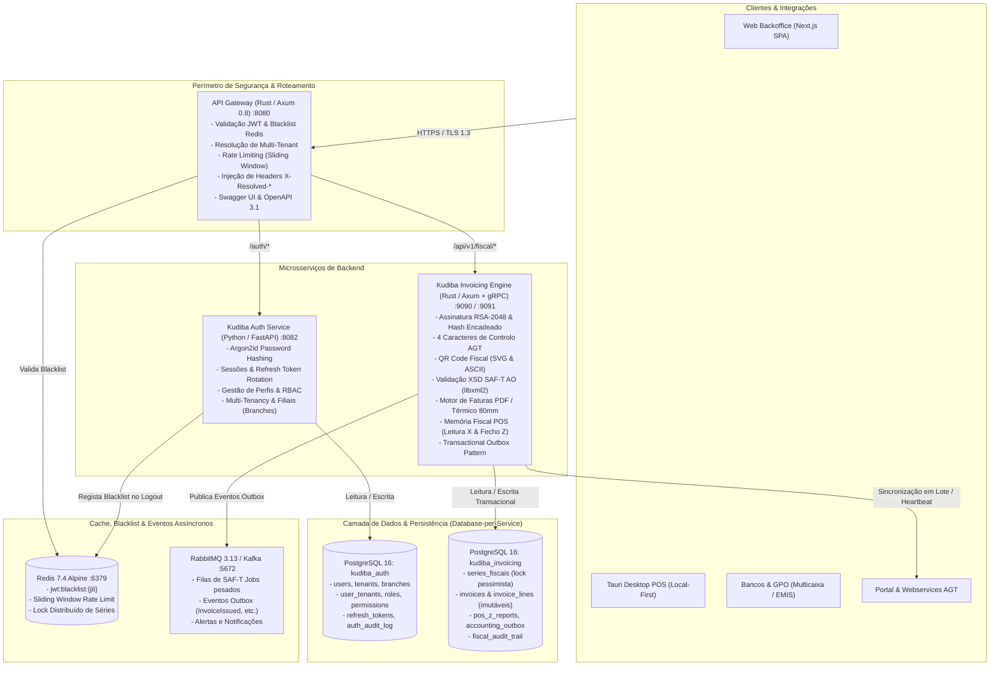

# Arquitetura Global do Sistema — Kudiba ERP

**Projeto:** Kudiba ERP (Ecossistema Cloud-Native & Edge-Ready para Angola)  
**Versão:** 1.1.0  
**Data:** Outubro de 2026  
**Conformidade Regulatória:** Decreto Presidencial n.º 71/25 de 20 de Março (RJFDE) e Decreto Executivo n.º 385/20 (SAF-T AO v1.01_01) da Administração Geral Tributária (AGT)

---

## 1. Visão Geral e Filosofia Arquitetural

O **Kudiba ERP** foi concebido para o mercado empresarial e regulado da República de Angola e da África Subsaariana. Em substituição aos tradicionais softwares legados (Primavera/Cegid, PHC, Sage) que impõem elevadas dependências de licenciamento de software proprietário (Windows Server e Microsoft SQL Server), o Kudiba opera com uma arquitetura moderna, distribuída, baseada em tecnologias abertas de alto desempenho, resiliência de rede e conformidade fiscal contínua.

### Pilares Fundamentais:
1. **Desempenho Extremo e Custo Operacional Reduzido (TCO):** Componentes críticos e de alto volume de tráfego construídos em **Rust** (API Gateway e Motor Fiscal KudibaInvoicing) com tempo de resposta sub-milissegundo ($p99 < 0.8\text{ms}$) e consumo mínimo de memória RAM.
2. **Flexibilidade e Agilidade no Domínio de Identidade:** Módulo de autenticação, multitenancy e RBAC construído em **Python (FastAPI + AsyncIO)**, acelerando o ciclo de vida de regras organizacionais e de utilizador.
3. **Database-per-Service (Segregação Estrita de Dados):** Cada microsserviço detém o seu próprio banco de dados relacional isolado (`kudiba_auth` e `kudiba_invoicing`), assegurando desacoplamento de schemas, independência de deploy e contenção de falhas.
4. **Clean Architecture & CQRS:** Camadas estritas de isolamento (Domain, Application, Infrastructure, Presentation) com segregação formal de Comandos e Consultas, além de Unit of Work transacional.
5. **Conformidade Regulatória Estrita com a AGT:** Implementação determinística das regras do Decreto Presidencial n.º 71/25, com assinaturas RSA-2048 encadeadas, 4 caracteres de validação, QR Code fiscal canónico, imutabilidade física de faturas e exportação do ficheiro SAF-T (AO) v1.01_01 em streaming $O(1)$.

---

## 2. Topologia do Sistema e Fluxo de Rede

O diagrama abaixo ilustra a comunicação de ponta a ponta, desde os clientes até à persistência e mensageria:



---

## 3. Padrões de Projeto e Arquitetura em Camadas

Ambos os microsserviços (`KudibaInvoicing` e `KudibaAuth`) partilham a mesma estrutura de pastas e separação de responsabilidades:

```
src/
├── domain/                  # 1. Regras Puras de Negócio (Isento de frameworks e I/O)
│   ├── entities/            # Entidades ricas com identidade e invariantes
│   ├── value_objects/       # Objetos de valor imutáveis (Email, TaxRegime, DocumentType, etc.)
│   ├── ports/               # Interfaces/Portas abstratas (Repositórios, Criptografia, Token, UoW)
│   ├── services/            # Serviços de domínio puro (Cálculo de impostos, políticas de segurança)
│   └── error.py | error.rs  # Exceções e erros semânticos de domínio
│
├── application/             # 2. Casos de Uso & Orquestração (CQRS)
│   ├── commands/            # Ações de escrita (IssueInvoice, AuthenticateUser, RotateToken)
│   ├── queries/             # Ações de consulta pura (GetInvoice, ExportSaft, GetUserProfile)
│   └── dto/                 # Contratos de entrada e saída (Pydantic / Serde)
│
├── infrastructure/          # 3. Adaptadores Secundários (Tecnologia, BD, Criptografia)
│   ├── persistence/         # Implementações de repositórios (SQLAlchemy / SQLx Postgres)
│   ├── security/ | crypto/  # Argon2id, JWT HMAC-SHA256, RSA-2048 PKCS#1 v1.5
│   ├── cache/               # Adaptadores Redis
│   ├── saft/ | reports/     # Geradores XML com libxml2, PDFs e tickets térmicos ESC/POS
│   └── outbox/              # Workers assíncronos e publicadores multicanal
│
├── presentation/            # 4. Adaptadores Primários (Entrada de Tráfego)
│   ├── http/                # Rotas REST, handlers e injeção de dependências
│   └── grpc/                # Servidor gRPC (Tonic Protobuf)
│
├── state.py | state.rs      # Contêiner de Injeção de Dependências (AppState)
└── main.py | main.rs        # Ponto de entrada da aplicação e ciclo de vida
```

### 3.1 Command Query Responsibility Segregation (CQRS)
- **Comandos (Commands):** Mutam o estado do sistema, operam sob transações ACID estritas protegidas pelo *Unit of Work*, aplicam validações de domínio e emitem eventos (ex.: emissão de fatura, login, rotação de token, cancelamento).
- **Consultas (Queries):** Apenas lêem dados sem efeitos colaterais. No `KudibaInvoicing`, consultas analíticas pesadas (relatórios de fecho, mapas fiscais de IVA e geração de SAF-T) são roteadas para réplicas de leitura (`DATABASE_READ_URL`), libertando a instância primária para escritas críticas.

### 3.2 Unit of Work (UoW) e Repositórios
As alterações atómicas a múltiplas entidades (ex.: registar fatura, gravar linhas, atualizar sequência da série e enfileirar evento de outbox) ocorrem num único ciclo de vida de transação:
- Em Python: `async with uow:` efetua commit determinístico ao sair do bloco ou rollback automático caso uma exceção de domínio seja disparada.
- Em Rust: `PgUnitOfWork` gerencia a transação SQLx ativa e despacha eventos apenas após a confirmação transacional no disco.

---

## 4. Segurança, Identidade e Perímetro Zero-Trust

### 4.1 Validação Perimétrica no API Gateway (Rust)
O API Gateway atua como barreira inexpugnável:
1. **Prevenção de Header Spoofing:** Qualquer cabeçalho do tipo `X-Resolved-*` ou `X-User-ID` enviado pelo cliente externo é imediatamente removido na entrada do gateway.
2. **Validação Criptográfica de JWT:** Para rotas protegidas, o Gateway valida a assinatura HMAC-SHA256 do token usando a chave secreta compartilhada `JWT_SECRET`.
3. **Verificação de Revogação Imediata (Blacklist no Redis):** O Gateway consulta a existência da chave `jwt:blacklist:{jti}` no Redis em tempo constante $O(1)$. Se o token constar da blacklist, a requisição é rejeitada de imediato com HTTP `401 Unauthorized`.
4. **Injeção de Metadados Confiáveis:** Uma vez validado o token, o Gateway injeta os cabeçalhos confiáveis para consumo downstream:
   - `X-Resolved-Tenant-ID`: Identificador da organização.
   - `X-Resolved-User-ID`: Identificador do utilizador logado.
   - `X-Resolved-Roles`: Perfis atribuídos (ex.: `ADMIN,CONTABILISTA`).
   - `X-Resolved-Branch-ID`: Filial ativa associada à sessão.
   - `X-Request-ID`: Correlation ID único para rastreamento distribuído.

### 4.2 KudibaAuth: Hashing e Ciclo de Sessões
- **Argon2id:** As senhas dos utilizadores são protegidas pelo algoritmo Argon2id com 64 MB de alocação de memória, 3 iterações de tempo e 4 threads paralelas (padrão OWASP).
- **Refresh Token Rotation (RTR):** Cada pedido de renovação consome o refresh token atual e emite um novo par de tokens.
- **Detecção de Reúso de Token:** Se um refresh token já consumido for apresentado novamente, o sistema reconhece um potencial ataque de clonagem de sessão, invalida imediatamente toda a árvore de sessões do utilizador (*family revocation*) e bloqueia novos acessos até novo login formal.
- **Proteção Anti-Bruteforce:** Tentativas consecutivas de autenticação incorreta incrementam o contador de falhas da conta. Após 5 falhas consecutivas, a conta é bloqueada temporariamente e um registo de auditoria é emitido na tabela `kudiba_audit.auth_audit_log`.

---

## 5. Conformidade Fiscal AGT (Decreto Presidencial 71/25)

O microserviço `KudibaInvoicing` cumpre a totalidade dos requisitos técnicos de software de faturação certificados pela AGT em Angola:

### 5.1 Numeração Sequencial Imutável (*Zero Gaps*)
Em conformidade com a exigência legal de que não podem existir saltos de numeração entre documentos fiscais:
- Ao emitir um documento de uma série fiscal, o sistema executa um bloqueio pessimista:
  ```sql
  SELECT current_sequence FROM kudiba_core.series_fiscais WHERE id = $1 FOR UPDATE;
  ```
- O próximo número é gerado (`SEQ = current_sequence + 1`) e persistido atomicamente dentro da transação da fatura.
- **Proteção de Banco de Dados:** O gatilho SQL `trg_protect_invoices` proíbe terminantemente operações de `UPDATE` ou `DELETE` nas tabelas `invoices` e `invoice_lines`, resultando num erro severo de banco de dados se alguém tentar violar a imutabilidade fiscal.

### 5.2 Criptografia RSA-2048 e 4 Caracteres de Controlo
- Cada fatura é assinada digitalmente com RSA-2048 (PKCS#1 v1.5 com SHA-256).
- O buffer canónico é montado estritamente na forma:
  $$\text{Buffer} = \text{DataEmissao} + ";" + \text{DataEntrada} + ";" + \text{NumeroDoc} + ";" + \text{TotalBruto} + ";" + \text{HashAnterior}$$
- A assinatura gerada em Base64 é encadeada com os documentos anteriores.
- Os **4 caracteres de controlo** são extraídos das posições **1.ª, 11.ª, 21.ª e 31.ª** da assinatura (indexação 1-based) e impressos no documento (ex.: `A;K;9;p`).

### 5.3 QR Code Fiscal Oficial AGT
- O payload canónico exigido pela norma técnica é gerado no formato:
  `A:NIF_EMITENTE*B:NUMERO_DOC*C:TOTAL_BRUTO*D:DATA_EMISSAO*E:HASH_ASSINATURA`
- Suporte nativo a geração de matriz gráfica em **SVG** (para PDFs de alta definição) e formato **ASCII/ESC-POS** para impressoras matriciais e térmicas de balcão.

### 5.4 Retenção de Serviços (6,5%) e Imposto de Selo (0,7% e 1,0%)
- **Retenção na Fonte de 6,5%:** Aplicada automaticamente a linhas do tipo serviço (`isService: true`) conforme o Regime Jurídico das Faturas e a Lei do Imposto Industrial.
- **Imposto de Selo:**
  - `0,7%` aplicado em Faturas-Recibo (`FR`) e documentos com quitação a pronto pagamento.
  - `1,0%` em transações a prazo e contratos sujeitos a imposto de selo geral.
- Totalizadores explícitos no payload e nos relatórios (`withholdingTotal`, `stampDutyTotal`, `amountDue`).

### 5.5 Anulação Legal com Nota de Crédito (NC)
- É terminantemente proibido apagar faturas emitidas. Para retificar ou anular um documento, o endpoint `POST /api/v1/fiscal/invoices/{id}/cancel` emite uma Nota de Crédito retificativa vinculada ao documento de origem (`sourceDocumentNumber`), invertendo contabilisticamente débitos e créditos.

### 5.6 Memória Fiscal POS (Leitura X e Fecho Z)
- **Leitura X:** Relatório informativo intradiário de conferência de caixa sem fechar a sessão fiscal.
- **Fecho Z:** Relatório diário oficial e obrigatório. Possui numeração sequencial anual (`Z YYYY/NNNNNN`), data de gravação, totalizadores acumulados e é guardado de forma permanente na tabela `kudiba_core.pos_z_reports`.

### 5.7 Geração e Validação do SAF-T (AO) v1.01_01
- **Streaming em Memória Constante ($O(1)$):** Ao exportar ficheiros SAF-T de milhões de registos, o gerador faz streaming de leitura paginada no banco e escrita incremental para o cliente HTTP, prevenindo exaustão de memória RAM.
- **Validação XSD Nativa:** Validação contra o schema oficial da AGT (`schemas/SAFTAO1.01_01.xsd`) utilizando o compilador nativo `libxml2`.
